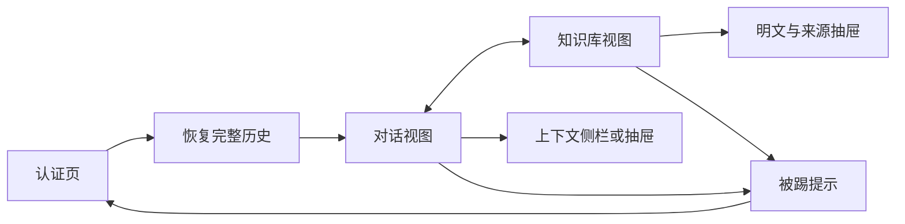

# UI 与交互规格

## 1. 视觉与交互目标

采用React＋TypeScript和Ant Design的组件体系（技术草案），以Codex式左导航/右内容关系作为用户提供的视觉参考，不复制其品牌，不承诺像素还原。偏简洁、中性背景、少量青绿色强调，状态优先于装饰。无已有截图、品牌稿或Logo；先用“Hello Travel”文字和简单指南针图形。

## 2. 页面清单和层级

| ID | 页面 | 流程 | 需求 |
|---|---|---|---|
| SCREEN-001 | 认证页：密码登录/验证码登录/设置或重置密码切换 | FLOW-001～003 | F001～007 |
| SCREEN-002 | 主壳与空会话状态 | FLOW-004 | F008/F011/F027/F028 |
| SCREEN-003 | 对话详情＋上下文侧栏 | FLOW-005～007/009 | F009～021/F028 |
| SCREEN-004 | 知识库上传＋资料列表 | FLOW-008 | F022～026 |
| SCREEN-005 | 明文/来源详情抽屉 | FLOW-008 | F023/F024/F025 |
| SCREEN-006 | 被踢/认证过期覆盖提示 | FLOW-002/009 | F006/F007/F028 |

## 3. 页面流转



后台收到其他对话消息不自动切换SCREEN-003；侧栏标记新消息，选中时呈现同步后的完整历史。阅读位置和未发送草稿由当前页面维护，本期不实现跨设备阅读回执和草稿共享。

## 4. 页面详细规格

SCREEN-001：邮箱输入、密码显隐/验证码输入、申请验证码倒计时、主按钮、密码或验证码登录切换，以及设置/重置密码入口。首次验证码登录自动创建账号；密码及码均不进入地址栏，设置完成后回登录。认证受理/失败保留可修正字段，不回显服务器密钥或原始错误。

SCREEN-002/003：桌面左栏约260px，可收起；Logo位于顶部，平级菜单“对话管理”“知识库管理”。对话管理下“＋新对话”和tab条目（名称、菜单、页面内新消息标记）。左底邮箱/退出。右侧上方只显示当前标题与连接状态，不向用户展示内部迭代期次。中间消息历史按角色左右分布并使用不同背景色，底部输入框和发送/停止按钮。右侧约260px上下文区域，窄窗口折为按钮抽屉。

```text
┌ Hello Travel ──────┬ 景德镇周末旅行 · 已连接 ──────────┬ 本轮上下文 ───┐
│ 对话管理          │ 用户：两天、一人、预算1500        │ 估算 42%      │
│  ＋新对话         │ 助手：分日路线…                  │ 输入 / 预算   │
│  景德镇周末旅行 ⋯ │  引用：官方资料 [来源与日期]      │ 组成 / 压缩   │
│ 知识库管理        │                                 │ 输出预留      │
│                  │ 输入… Shift+Enter换行  [发送]     │ 状态更新      │
│ 邮箱 / 退出       │                                 │              │
└──────────────────┴─────────────────────────────────┴──────────────┘
```

一对一对话不展示“你”或产品名称作为消息头。用户气泡在悬停或键盘聚焦时显示复制、删除；助手消息正文下始终显示复制、删除。点击任一删除操作默认进入选择态并选中该轮相邻的用户提问与助手回答，选择态允许逐条取消或增加，确认后才调用批量删除。失败/取消回答有状态；Markdown仅渲染允许语法，关闭任意HTML/脚本；引用链接限定http/https并提示外部来源。新增消息时仅在用户已接近底部才跟随滚动，否则显示“有新消息”。

上下文侧栏显示：本轮预算占比、输入估算、回答/安全预留、应用上下文上限、压缩状态/最近更新时间。占比明确包含回答与安全预留，不能表述为历史消息已经消耗的 token；最终供应商实际用量单列，避免当作下一轮完整预算。切会话使用对应run或本会话的预算状态。

SCREEN-004：上传区、允许格式/大小说明、资料总数；列表列标题、文件名、来源、状态、上传时间、明文/重试操作。明文不在表格一行无限展开，SCREEN-005分段读取全部内容。资料删除为产品待批建议，不含编辑/分享。

SCREEN-006：明确“此页面登录被同设备的新登录替换”；保留当前视图的不可提交状态提示，清除认证凭据/订阅，回登录按钮。旧页面不能自动利用共享新Cookie刷新成新登录。

## 5. 组件及复用关系

| ID | 组件 | 复用/Ant Design映射 | 主要职责 |
|---|---|---|---|
| COMP-001 | AppShell | Layout/Menu/Drawer | 两个同级菜单、账号区、响应式 |
| COMP-002 | AuthForm | Form/Input/Button/Alert | 四种认证流程及受控错误 |
| COMP-003 | ConversationList | List/Dropdown/Modal | tab选择、新建、名称、删除 |
| COMP-004 | MessageHistory | 虚拟列表＋Typography | 稳定顺序、全文恢复、选择/删除、滚动 |
| COMP-005 | MessageComposer | Input.TextArea/Button | 输入法、发送幂等、繁忙/停止 |
| COMP-006 | ContextPanel | Progress/Statistic/Tag | 明确估算、组成和压缩状态 |
| COMP-007 | SourceCitation | Typography.Link/Popover | 资料来源、日期、适用范围 |
| COMP-008 | KnowledgeUpload/List | Upload/Table/Tag | 类型校验、处理进度和重试 |
| COMP-009 | PlainTextViewer | Drawer/Typography | 安全明文分页及来源 |
| COMP-010 | ConnectionIndicator | Badge/Alert | 在线、重连、补齐、过期重建 |

## 6. 加载、空、成功、异常和禁用状态

| 场景 | 可见状态 | 可执行动作 | 禁用或恢复 |
|---|---|---|---|
| 恢复历史 | 进度＋已恢复消息 | 查看已恢复部分、切换已就绪会话 | 所选会话首轮恢复完成前不发新消息 |
| 空会话 | 欢迎和示例问题 | 输入/新建 | 不显示虚假的预算实际值 |
| 对话生成 | 准备回答、正在回答、已完成等通用状态 | 查看流式结果、停止、重命名 | 同会话不发送第二请求，删除消息需先停止；规划、检索、压缩等内部阶段不直接暴露 |
| 模型失败 | 已保存的输入/草稿＋错误 | 重试该run | 不生成重复用户消息 |
| 索引失败 | FAILED＋内部错误分类 | 重试/查看已提取明文 | 不显示“已可检索” |
| 同步断线 | “重连/补齐中” | 重连；提交可用性取决于HTTP结果 | 不把掉线视为数据丢失，不静默离线创建 |
| 被踢/过期 | 明确提示 | 显式登录 | 禁止提交/文件读取/订阅，不能自动换sid |
| 删除确认 | 影响历史和记忆的说明 | 确认/取消 | 不以压缩文案混淆删除 |

## 7. 表单校验与反馈

邮箱格式、密码建议12～128字符、tab名建议1～120字符、空消息拒绝、验证码六位建议；最终与产品/服务端配置一致，不只做前端校验。验证码倒计时依据服务端Retry-After或返回时间，切方式不能绕限流。文件建议TXT/MD/PDF≤10MiB，说明提取文本也有限制。所有错误关注用户可修正操作，不展示原始堆栈。

## 8. 响应式规则

≥1280px三栏；768～1279px左导航可收起，上下文抽屉；<768px导航改抽屉，聊天/知识全宽，输入在可见底部但不遮消息。断点为实现建议，无用户品牌稿或测量依据。历史DOM虚拟渲染不代表服务端或客户端只恢复最近N条。

## 9. 键盘操作与无障碍

Enter发送、Shift+Enter换行；event.isComposing或组合输入期间不发消息。Tab可访问菜单、操作按钮、引用与进度面板；危险确认默认聚焦取消；抽屉/弹层关闭后焦点回触发按钮。按钮有可读名称，状态同时使用文字；流式文本避免每个token触发屏幕阅读器播报，仅阶段/完成通知使用aria-live。

## 10. 素材与文案

文字Logo为暂定；不需要AI位图素材。视觉参考仅SRC-001对Codex布局的描述。使用产品第9节通知文案。天气/价格未知和官方资料受限须可见，引用不能只在后端日志中。

## 11. 设计假设与待确认项

颜色、尺寸、Logo为建议；统一验证码登录和密码设置/重置安全规则已确认，私有知识库仍待产品确认。浏览器实例定义、完整历史后台恢复、生成中删除策略与断线补齐的具体行为已随本方案可审阅，不以“像微信”扩大为社交产品。

## 12. 变更记录

0.1：首次UI规格，加入SRC-002的多设备同步、同设备页面替换和完整历史恢复。未实现页面，未声称浏览器验证通过。
