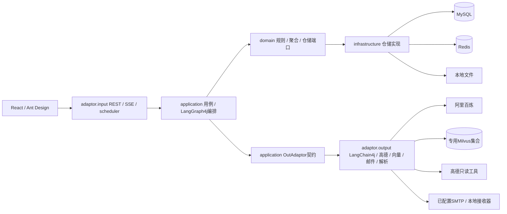
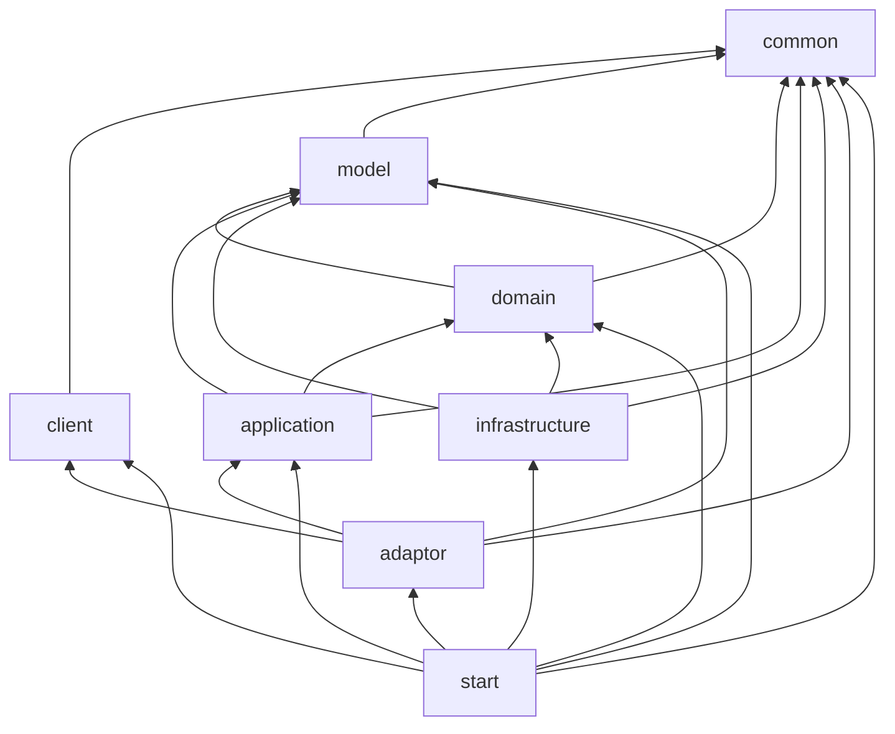
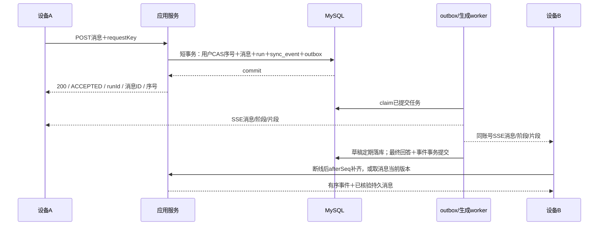
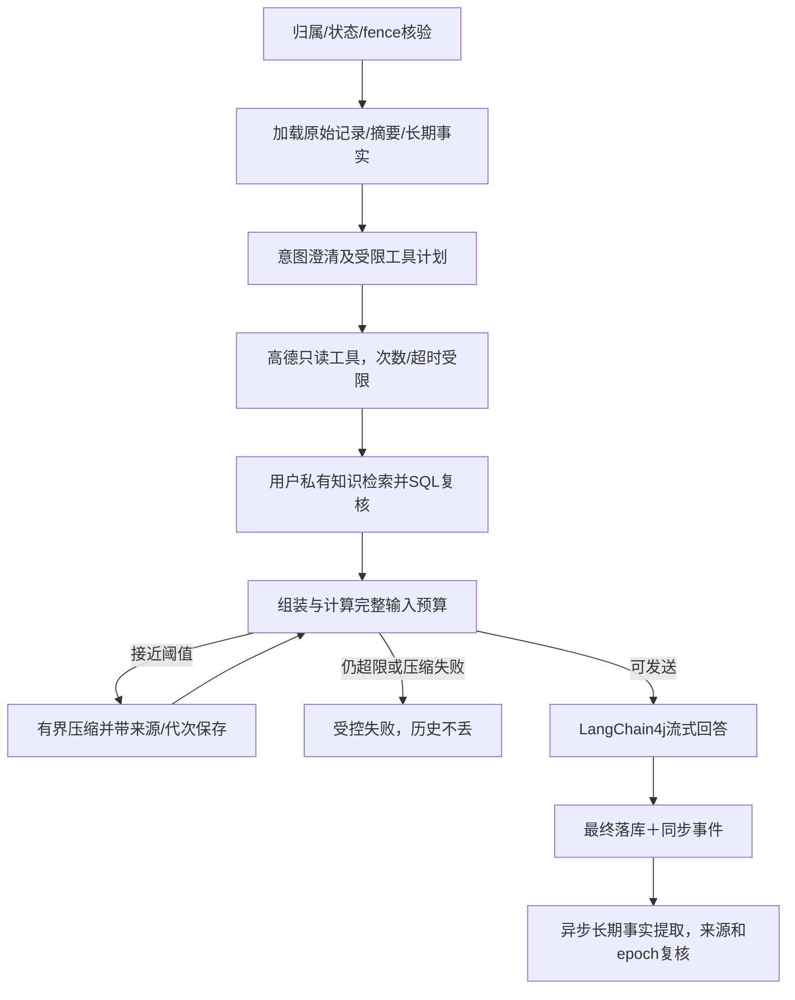
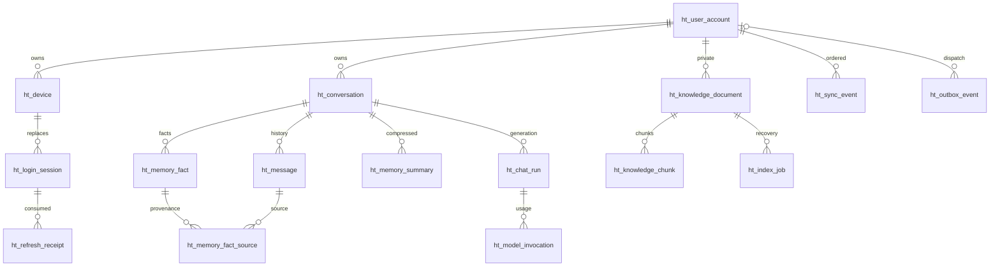

# 技术方案

## 1. 背景、目标与预期价值

### 1.1 事情背景与问题

新项目hello-travel用于本地旅行助手一期，同时检验solo的文档、工程与质量流程。项目开始时已有交付材料，无既有Java/前端业务工程、构建配置或项目AGENTS.md；不能假定已有认证、模型调用或数据库模型。父目录指令检查未发现AGENTS.md。

用户明确的本次成果是**05代码生成完成**，用于审阅方案和代码质量。此方案已对应一期代码与有限检查，详见05；文档本身不能证明完整自测、CR、独立测试或部署完成。二期交易、订单逆向和支付不实施。

### 1.2 业务价值与技术价值

| 维度 | 预期价值 | 可观察方式 |
|---|---|---|
| 规划 | 对话补充条件，路线/交通/提醒/政策有来源和时效 | 来源一致、未知明确、分日建议可读 |
| 连续体验 | 微信式核心消息同步、多设备并行、页面内互踢、完整历史恢复 | 在线同步、断线补齐、旧sid失效、不丢已提交消息 |
| 数据治理 | 全历史、摘要、长期事实和知识索引各有来源和生命周期 | 归属外键＋服务端授权；删除不通过派生记忆复活 |
| 工程 | 单机下保留构建边界、事务、幂等、恢复、限流和可观测性 | 多module、配置契约、迁移、测试代码与真实检查证据 |
| 交付 | 用户可直接审阅表结构和核心代码的对应关系 | 稳定REQ/TECH/DATA/API/TASK编号，不用模板数量冒充完成 |

## 2. 调研、推演与核心矛盾

### 2.1 已确认事实、假设与待决问题

| 类型 | 内容 | 来源 | 影响 |
|---|---|---|---|
| 已确认 | MySQL库hello-travel，多业务表，不分库分表 | SRC-001/002 | 正常范式设计；库名连字符正确转义 |
| 已确认 | 多设备并行、任意设备新消息同步，同设备新页面登录替换旧登录，新登录全量历史 | SRC-002 | 需要可撤销登录、持久同步游标、快照与补齐 |
| 实测 | Java17.0.19/Maven3.9.16/Node24.18.0/npm11.16.0；MySQL8.4.11登录成功；Redis8.10.1单机 | SRC-003 | Java17编译基线；明确依赖兼容验证 |
| 实测 | Milvus容器镜像标签v3.0.0、19530可连接、9091健康OK；未调用SDK确认服务端version | SRC-003 | 使用3.0.x SDK基线，SDK连通/功能验证后续执行 |
| 实测 | 找到DASHSCOPE_API_KEY、AMAP_MAPS_API_KEY、MYSQL_USERNAME/PASSWORD变量；未输出值 | SRC-003 | 从进程环境注入，不写仓库配置 |
| 实测 | hello-travel库utf8mb4/utf8mb4_0900_ai_ci，17业务表及Flyway迁移记录 | SRC-003 | SRC-017授权迁移已执行，账号0；V1冻结 |
| 实验 | 16表DDL临时库执行与5类约束拒绝检查通过，随机临时库已删除 | SRC-003 | 证明SQL语法和部分约束，不代替应用测试 |
| 待核验 | SMTP、模型账户权限/地域/配额、真实工具权限、嵌入调用和Milvus schema API | SRC-003 | 首版需明确不可用状态；不能写假验证码/假数据 |
| 待用户审批 | 私有KB、邮箱验证注册/验证码不自动注册、重置全设备撤销、文件限制和生成中删除规则 | 02产品方案 | 技术按建议编制，审批不冒充已完成 |
| 资料限制 | 官方博物馆预约须知检索条目可定位，但正文HTTP返回验证页；无已核验付费退票全文 | SRC-012 | 示例待正文核验；不声称已导入可检索官方政策 |

### 2.2 核心问题、矛盾与方案选择

| 矛盾 | 可选方案 | 草案选择 | 收益与代价 |
|---|---|---|---|
| 多设备同步与单设备互踢 | 一个账号一token；共享Cookie自动跟新；设备内可撤销页面sid | 设备内一个ACTIVE sid，旧页面持有原sid；其他设备独立；刷新核验原sid | 精确互踢；必须防旧页通过共享新Cookie自动重绑 |
| 全量历史与资源上限 | 一次无界SQL/JSON；只返回最近N条；完整分页恢复 | 全tab清单、按会话完整keyset分页，所选优先、后台恢复，虚拟渲染 | 不丢历史；需恢复进度/版本一致性与新事件缓冲 |
| 推送与可靠性 | Redis Pub/Sub作为唯一消息；只轮询；MySQL持久事件＋SSE | 业务数据/用户序号/事件/outbox同事务，SSE实时，REST补齐，游标过期重快照 | 不把推送成功当存储成功；增加事件/发件箱表 |
| 全历史与模型记忆 | 把所有历史塞模型；仅固定N条；来源可撤销的多层记忆 | MySQL完整历史＋近期片段＋结构化摘要＋显式长期事实，全部会话隔离 | 上下文可控；摘要/事实需要版本、来源和删除传播 |
| 单机与企业逻辑 | 一个Controller堆全部代码；多微服务；模块化单体 | 八个Maven层module、单服务运行，端口/适配器、事务/CAS/有界工作流 | 保留编译边界，不制造本机微服务运维成本 |
| MySQL/Milvus一致性 | 分布式事务；先写向量就算成功；代次＋可恢复任务 | MySQL为资料事实源，先持久任务，再幂等向量upsert，READY后检索，查询时SQL复核 | 无跨组件原子承诺；恢复和过期索引清理有明确职责 |
| 精确token与Qwen差异 | 用字符数冒充token；GPT tokenizer当精确；保守估算＋实际usage | 本地保守估算明确标签，供应商确实返回usage后补充；预算独立配置 | 不虚报精确；保守估算可能提前压缩，需真实数据校准 |

## 3. 整体技术方案

### 3.1 架构与职责边界（TECH-001）

前端为React/TypeScript/Ant Design的Vite工程；后端为模块化Spring Boot单服务。包根`com.hellotravel`，各module按auth/chat/memory/knowledge/travel/sync子域组织。MySQL事实源、Redis短时限流/工具缓存/辅助协调、Milvus专用知识向量集合、受限本地文件存储。业务模块不得依赖start。



| module/artifactId | 职责及直接内部依赖 | 实际外部依赖边界 |
|---|---|---|
| hello-travel-common | Result/ErrorCode/异常，无业务 | 只JDK，不依赖Spring/数据库/HTTP |
| hello-travel-client | API Request/Response，只依赖common | 协议校验注解可用；不能依赖model/domain |
| hello-travel-model | 内部稳定DO，仅数据，无实体行为，只依赖common | 只JDK，无PO和供应商模型 |
| hello-travel-domain | Aggregate/Entity/Value、DomainService、Repository端口；common/model | 只JDK，禁止Spring/Jakarta/MyBatis等 |
| hello-travel-application | Command/Result/assembler/用例/OutAdaptor/工作流；domain/model/common | Spring组件/短事务边界、LangGraph4j core用于编排；不依赖具体SDK、PO或adaptor实现 |
| hello-travel-infrastructure | PO/Mapper、MyBatis-Plus仓储、Redis/文件存储；domain/model/common | MySQL/Redis/文件实现；不向上暴露Page/IPage/原始SQL |
| hello-travel-adaptor | input Controller/SSE/scheduler，output外部读写转换；application/client/model/common | LangChain4j OpenAI兼容客户端、Milvus SDK、高德HTTP、SMTP、PDF解析，第三方对象私有 |
| hello-travel-start | Application、扫描/装配、数据库迁移、Logback/安全/模型配置 | 直接列出其余7个实际运行模块；无业务流程，配置可部署 |

构建依赖方向为下层端口/数据；业务调用可以到具体注入实现，不能据调用图把infrastructure反向导入application。app使用LangGraph4j core是工作流技术编排依赖，不将框架类型放入domain/client/model。领域标记和装配、构造器注入、转换与Result边界采用随包Java DDD规范；纯装配注入字段/构造器不写重复注释，业务状态/接口保留说明。



**实施版本基线（TECH-002）**：已完成真实源码构建、默认版本安装及独立消费检查；具体证据见05。根集中固定Java17、Spring Boot3.5.16、MyBatis-Plus3.5.17、LangChain4j1.20.0、LangGraph4j core1.8.27、Milvus Java SDK3.0.5。前端核验registry：React19.3.0、Ant Design6.6.4、Vite8.3.0、TypeScript7.0.2；Node24.18.0满足已核验Vite的Node版本条件。实际前端版本由package-lock.json锁定；编译、类型与装配检查通过不代表外部服务已经联调。Flyway固定11.20.3，并排除PDFBox传递的commons-logging，由Spring JCL提供日志桥。

Spring Boot3.5的Java要求见[官方系统要求](https://docs.spring.io/spring-boot/3.5/system-requirements.html)；LangChain4j采用[官方模型客户端](https://docs.langchain4j.dev/get-started/)，通过[百炼OpenAI兼容接口](https://help.aliyun.com/zh/model-studio/compatibility-of-openai-with-dashscope)避免额外starter版本绑定。LangGraph4j core作为[StateGraph编排库](https://github.com/langgraph4j/langgraph4j)，不引入未使用的langchain集成模块。Milvus3.0.x与SDK基线参照[官方兼容表](https://milvus.io/api-reference/java/v3.0.x/About.md)。

POM核验发现LangChain4j1.20.0含2.22.1 Jackson直接依赖及reactive-streaming beta30依赖，而Boot3.5与LangGraph有各自版本管理。需要根统一Jackson BOM并通过effective-pom/dependency:tree/编译和启动检查；草案不是兼容证明。若无法建立可验证基线，调整到经构建验证的版本并记录，而不是强行排除类或全局跳过门禁。生产支持周期、未使用beta依赖和漏洞扫描仍需要真实评审，当前没有“生产就绪”结论。

root采用`revision`单点版本、子module parent.version=`${revision}`、内部依赖根管理；Flatten解析CI版本，实际绑定Checkstyle validate。正式编码前在本项目安装Java DDD门禁和规范副本，保持C/P/R真实检查边界。

### 3.2 核心流程、时序与模型

#### TECH-003 认证、设备内互踢与页面绑定

- 密码使用Argon2id带盐哈希，建议m=19456KiB/t=2/p=1作为可调下限，生产硬件需实测；依据[OWASP密码存储建议](https://cheatsheetseries.owasp.org/cheatsheets/Password_Storage_Cheat_Sheet.html)。验证码不能用无密钥SHA256抵抗六位码离线枚举，采用用途/邮箱/挑战ID绑定的HMAC，校验密钥仅进程配置。
- 设备ID由服务端创建的高熵Cookie实例标识，保存其哈希；同浏览器配置稳定，清Cookie/隐私窗口属于新实例。不依赖User-Agent或IP当真实物理设备标识。
- 登录事务先占账号CAS版本，再按设备撤销旧ACTIVE session、清空其认证哈希并插入新session；唯一活动槽兜底并发登录。其他device_id的登录不撤销。事务同时写登录撤销事件/发件箱，提交后立即关闭旧sid SSE，重放用于故障补偿。
- access和refresh为高熵随机令牌，SQL只存哈希，access仅页面内存，refresh在HttpOnly/SameSite Cookie。认证每次查SQL会话状态、有效期和账号auth_epoch，不让滞后Redis缓存绕过撤销。
- 页面`sessionStorage`保存非秘密的原sessionPublicId。刷新/恢复须提交expectedSessionId；同浏览器Cookie被新登录更新后，旧页面expected sid不匹配即返回SESSION_REPLACED，不能自动切到新sid。新tab主动登录建立新sid；导航/当前有效页刷新不重复主动登录。
- refresh轮换使用CAS，单页请求single-flight；旧refresh令牌重放拒绝并撤销对应旧sid，不能因为旧页面携带新Cookie而撤销新sid。Cookie共享与sid不匹配先判替换，禁止自动跟新。
- Cookie认证端点执行Origin/允许来源、SameSite和CSRF校验，不将令牌放查询参数；SSE使用带Authorization的fetch流，避免EventSource不支持自定义认证头的限制。服务默认127.0.0.1，本地HTTP profile明确区别生产Secure Cookie/TLS配置。
- 注册、验证码消费和账号创建/密码重置均短事务；密码在外层按快照验证后，提交CAS必须核验同一credential版本，重置后不能复用旧密码校验结果；验证码成功消费与注册/登录/重置在同一事务提交，避免业务失败却先吞码。失败次数CAS递增且与成功消费互斥，过期/用途不符不能消费。验证码挑战同邮箱用途唯一有效槽。
- SMTP未配置返回受控不可用；异步发件箱只引用挑战，待发送码用独立密钥AEAD密文保存，发送后清除密文。不记录固定验证码，不在日志打印码，不在本回合发真实邮件。
- 重置建议auth_epoch递增、撤销所有旧sid；退出只撤销当前sid。已经合法接受的生成任务不因普通页面被踢/退出而丢失，新有效页面仍能看到；账号禁用或对话删除使任务栅栏失效。

#### TECH-004 持久消息、幂等与跨设备同步



MySQL保存所有已接受USER/ASSISTANT记录与生成状态，不以浏览器缓存/Redis队列作事实源。一个请求先分配user/assistant两个稳定消息序号，回答草稿用已有assistant行更新；不会每个token产生一条聊天消息。

请求key按用户＋对话唯一，同时保存规范正文摘要；同key同内容返回原run，同key换内容409。并发不同requestKey同对话由唯一进行中槽与会话CAS拒绝；显式retry沿用原输入和原回答位置，不追加重复用户消息，首次领取保留已建立的attempt_count=1；显式retry以CAS递增该数，worker重新领租只增加fence。每次调用先持久(runId,runAttemptNo,stage,attemptNo)证据，再进行外部请求；同一生成尝试内阶段调用编号递增。已发请求但无完成证据时记录INTERRUPTED，不以相同或新编号偷偷重复计费。

**序号提交顺序**：sync_event使用每用户event_seq，不用全局AUTO_INCREMENT作游标。每次业务事务先以账号.version做CAS，写新的sync_seq持有该行写锁到commit，再按固定user→device/conversation→run/message→event顺序写；同账号事务因此在提交顺序上串行。CAS冲突在外层完整事务重试最多3次，不能继续使用失败事务或产生提交缺口。模型调用不在该事务中。代价是同账号提交串行，但本地交互规模可控，必须后续测量，不声称集群吞吐达标。

**SSE与补齐**：每账号已认证设备订阅其自己的事件。持久事件有event_seq、type、目标ID、entityVersion，不包含令牌或完整私密正文。SSE只发送持久事件，回答流式草稿约500ms落库后发送progress事件，客户端拉取并按版本合并；没有另行发送未持久化token的第二条通道。同账号所有有效设备按完整event_seq序列推进游标；定向撤销只有目标sid采取退出动作，其他设备也推进该事件序号。客户端以事件序号去重，以实体版本防旧事件覆盖新状态；流式草稿每约500ms或有界字数落库并发progress事件，完成以最终消息为准。另一设备即使漏token片段，也能取已持久草稿/最终消息，不出现永久缺回答。

Outbox至少一次派发，handler按dedupe_key和任务代次幂等。SQL里PENDING/ACCEPTED状态可被定时协调器重新发现，不能在仅入进程队列后就把模型任务当完成。SSE连接慢/队列满则关闭让客户端补齐，不无界缓冲；每1秒重新核验有效SID并补齐事件，60秒关闭连接供客户端续接；撤销最迟在下一次核验关闭。发送使用独立4线程/100容量队列，每连接同时只有一个发送任务。

**新登录完整恢复**：读取用户高水位和全部会话manifest；每个会话消息按seq正向keyset分页，默认每页100条/上限200，直至服务端hasMore=false。所选优先，其余按有界分页顺序恢复，虚拟列表只是DOM优化，不截断历史。bootstrap在一个短REPEATABLE_READ只读事务中读取syncSeq及首批manifest/会话ID上界；全量manifest按稳定ID分页至该上界，新tab和删除由缓冲事件合并，展示排序另按活动时间计算。每个会话首次读页取得snapshotMaxSeq与historyEpoch，后续只读seq≤该上界的记录；新消息由事件追加。流式正文/状态更新只增加实体version，不改变historyEpoch，客户端取当前实体版本合并，不因每500ms草稿更新从第一页重启。消息删除递增historyEpoch；不匹配时仅重读受影响会话并补齐删除事件，最多3次退避，持续删除则显示恢复受扰/可重试，不在后台无限循环。后台恢复未完成须显示状态。不能承诺跨多次HTTP请求天然同一个数据库事务快照。

先取bootstrap高水位并完成分页恢复，再从该高水位REST补齐、接续SSE；恢复期间的新事件保存在SQL，保留窗口过期即重建快照，避免恢复后从新的高水位跳过期间变化。断线afterSeq从SQL补齐，发现事件保留窗口过期或序号缺口返回SYNC_RESET_REQUIRED，重新取完整快照；Redis Pub/Sub/缓存丢失不影响消息历史。若推送暂不可用，短周期REST补齐作为降级；模型生成等待不计入“已提交新消息同步延迟”。

#### TECH-005 LangGraph4j与多层记忆

真实StateGraph位于application.travel.workflow，图持久状态仅携带runId、revision、node；用户/对话、epoch/fence和预算以SQL run为准，工具结果与私密提示仅在有界执行上下文中使用，不序列化到checkpoint。模型/高德/向量SDK仅由OutAdaptor实现，图节点调用应用用例与端口。框架checkpoint不作为全量消息数据库；MySQL run保存节点、图版本及受限状态，重启后恢复明确未执行任务，RUNNING且租约丢失标INTERRUPTED，已发送过模型请求的步骤不盲目自动重复计费。



| 层 | 事实源/内容 | 隔离与失效 | 输入限制 |
|---|---|---|---|
| 全量历史 | ht_message稳定序号/状态/正文/引用 | 用户＋会话；删除后活动视图排除 | 分页，不发送全量给模型 |
| 短期近期 | 已完成消息尾部，当前用户输入 | 用户＋会话；不把失败草稿当用户确认事实 | 建议最近6轮且有token上限，完整user/assistant关系保留 |
| 短期摘要 | ht_memory_summary结构化约束/事实/问题/来源范围 | memory_epoch匹配、来源范围仍有效；删消息使整会话旧摘要失效 | 实现摘要输出≤6000字节保守估算；模型请求maxTokens=2048 |
| 长期事实 | ht_memory_fact＋source，用户明确偏好/限制/已确认计划 | 用户＋会话；来源必须有效USER消息；有时效，禁止模型猜测/跨会话共享 | 按相关性/时间选取且有条数/token上限 |
| 知识资料 | READY本人文档/块＋已核验官方来源 | user过滤＋MySQL版本/代次复核，不属于用户事实记忆 | 检索topK有界，低相关不引用 |

删除任何消息在同一事务使conversation.history_epoch和memory_epoch递增，整会话旧摘要/长期事实立即不参与推理，异步只从未删除来源重建。外部提取任务携带epoch/fence，写回前重新核验，不得在删除后回填旧事实。knowledge chunk与对话记忆是不同集合/生命周期，不把一段模型回答当知识原文。

摘要来源不可靠或生成失败时安全退回更小的已完成近期上下文/明确提示，保留当前消息和系统约束；如果无法满足预算则本轮受控失败，绝不随机截掉关键约束。使用摘要/知识正文作为被标注的资料，不提升为系统授权。

#### TECH-006 上下文预算与压缩

默认选百炼qwen-plus（可配置地域URL/模型名，不把浮动模型别名当固定服务能力）。应用输入窗口草案32768，输出预留4096、安全裕量4096；有效输入budget=cap−outputReserve−safety。cap必须≤实际provider许可窗口；应用当前固定32768，修改模型需同步评审并验证窗口；具体模型能力待调用验证，不凭模型名称推断。

计算组成：system＋消息包装＋工具说明/受限结果＋有效summary＋recentMessages＋longFacts＋RAG引用文本＋当前输入。首版使用保守UTF-8字节估算加包装开销并标`utf8-upper-v1`，不是Qwen精确tokenizer；供应商usage确实返回时保存actual_input/output并显示差异。不把GPT tokenizer输出标为Qwen实际值。估算过大可更早压缩；超过真实窗口的供应商错误映射为受控超限，不能无限重试。

实际按输入估算＋输出预留达到窗口70%触发压缩，每run最多2次有界压缩；先滚动摘要覆盖更早完整轮次，仍达阈值则压缩近期来源，保留系统约束、当前输入、明确事实出处及未决问题。没有实现50%目标的自动循环，也不静默裁剪来源。达到100%仍不能压缩则请求用户缩短或开新对话，不静默丢当前输入。

前端在预估、检索完成、压缩开始/完成、回答完成时收到对应会话/run的budget快照；当前面板以服务端本轮快照为准，未实现输入中的本地动态token预估。图里每次额外模型调用单独记录ModelInvocation，不把多次调用sum当一个上下文窗口。

#### TECH-007 RAG/资料处理及Milvus

上传TXT/MD/PDF建议≤10MiB、提取明文≤2MiB；按真实文件内容检测、不仅看扩展名；PDF页数/解析时间有界，关闭不必要外部实体、路径和远程读取。服务端随机storage_key，原文件名只展示；保存文件失败不能创建READY条目。解析失败返回上传错误；已受理的索引失败有状态并可显式重试。

文件先受限解析、计算hash并通过临时文件原子移动到随机正式路径，再由SQL事务持久RECEIVED、提取明文及index_job；SQL失败可能留下文件，通过≥24小时无SQL引用的孤儿清理补偿。上传解析失败直接返回受控错误，不创建READY或可重试文档；已受理的索引失败可显式重试。MySQL事务不假装能原子覆盖本地文件。

解析→有界分块→批量嵌入→专用Milvus幂等upsert→SQL块READY/文档READY。嵌入默认百炼text-embedding-v4、1024维（配置固定），接口能力参照[官方模型信息](https://help.aliyun.com/zh/model-studio/text-embedding-v4)。新建集合`hello_travel_kb_v1_d1024`，schema显式为vector_key/owner_user_id/document_id/index_generation/chunk_no/content_hash/vector1024；不会操作用户已有集合。不把带连字符的项目名直接当Milvus标识。

初期collection保持默认Milvus数据库，仅使用专属集合；如后续需要独立Milvus database，再按已核验API创建，不假称已建。采用COSINE/HNSW或经SDK/资源验证可用索引；参数与collection schema不匹配即配置错误，不能drop重建已有集合。改变嵌入模型/维度须新增集合并修改适配器版本配置及全量重索引；当前固定一期集合，不存在自动切换或已经验证的回退工具。

检索只接受server认证owner；向量结果带ID/score不直接作为可用正文，批量读SQL验证owner、doc/chunk未删、docREADY、当前generation、hash一致后才组装引用。低相关无命中如实说明，提示注入正文不能触发高德之外任意工具。索引旧任务写回前检查generation/fence；删除资料先SQL排除再异步删向量，删除迟延也不得让RAG继续使用。SQL fence不能阻止已经发出的Milvus请求迟到upsert：每代次使用独立vector_key，旧回调不能设READY；另由有界周期协调器按本项目SQL文档/代次清单清理无效向量，重复失败保留待清理状态并告警。清理成功后仍定期核对删除墓碑，覆盖“清理后旧写才返回”的竞态；墓碑不能在未确认任务终态及对账完成前物理删除。只操作本项目collection及已核验owner/doc过滤，不扫描/清空其他集合。

已找到[景德镇中国陶瓷博物馆预约须知的官方检索条目](https://wgxl.jdz.gov.cn/zwgk/fdzdgknr/zdly/ggwh/t1085885.shtml)，但本次正文为验证页，不能核验完整内容；这属于预约取消信息来源候选，不是付费门票退款条款。提供来源摘要和待核验状态，不自动导入READY；后续获取真实官方正文或用户提供材料再生成引用数据。不得用第三方销售条款替代官方退改规则。

#### TECH-008 高德只读旅游工具

由服务端白名单HTTP适配器完成地点解析、天气、驾车路线/时距；一期没有实现独立POI搜索。天气使用城市adcode和返回预报日期，仅回答返回窗口；依据[高德官方天气API](https://lbs.amap.com/api/webservice/guide/api/weatherinfo)。地点/路线参数和错误按实际已核验对应API实现；开发阶段已补查官方天气/路线文档和实际协议字段，真实key权限与返回数据未调用验证。

每轮建议最多4次工具请求、有界地点数/文本长度，HTTP连接/读取超时和整体deadline；当前没有工具结果缓存；后续如启用，缓存key不得包含密钥。返回distance/duration/来源/查询时间及缺项，酒店和门票如无可靠来源应明确待核实，不提供虚构房价/库存。未授权key、配额耗尽或地点歧义受控降级。模型工具计划只能调用enum白名单，不能传任意URL、HTTP方法、数据库指令或发信请求；门票/酒店没有交易接口。

#### TECH-009 数据模型与表结构（按存储组件分开）

唯一DDL迁移：[V1__initial_schema.sql](../../hello-travel-start/src/main/resources/db/migration/V1__initial_schema.sql)。已按SRC-017授权通过Flyway创建17张MySQL业务表及迁移记录表，账号数为0；V1执行后冻结，任何变更新增迁移。原database/design SQL已移动，不维护双份DDL。空新schema迁移不默认开baselineOnMigrate或用IF NOT EXISTS吞schema漂移；检测到现有同名业务表要协调，不覆盖。

**MySQL：数据库`hello-travel`，DATA-001～016及DATA-018共17张关系表，含`ht_knowledge_chunk`；以下DDL和字段表全部属于MySQL。Milvus：独立DATA-017专用collection，结构独立列出；不在SQL文件建表。Redis：限流/缓存键，无关系表或知识向量集合。**

所有MySQL表InnoDB/utf8mb4；时间UTC DATETIME(6)，应用连接设时区；内部BIGINT不作为浏览器Number，对外用ULID字符串（权限不依赖ID难猜）。含归属的FK为复合(user,conversation/document/device,id)；FK只防越归属写入，不能代替SELECT/订阅授权。状态CHECK与唯一活动槽兜底领域规则；version为CAS，应用不得无版本更新状态。

| ID | 表 | 职责 | 关键约束/字段 |
|---|---|---|---|
| DATA-001 | `ht_user_account` | 账号及用户同步序号 | email_normalized唯一；auth_epoch全设备撤销；sync_seq按用户提交排序 |
| DATA-002 | `ht_device` | 账号下的浏览器设备实例 | unique(user_id,device_key_hash)；稳定浏览器实例，不依赖可伪造的物理指纹 |
| DATA-003 | `ht_login_session` | 可撤销的页面登录会话 | 访问/刷新令牌仅存哈希；生成槽unique(active_device_id)确保每设备一个ACTIVE登录 |
| DATA-004 | `ht_email_challenge` | 用途隔离的一次性邮箱验证码 | 邮箱＋用途＋有效槽唯一；HMAC验证、失败次数、到期和一次性消费；异步投递用AEAD密文 |
| DATA-005 | `ht_conversation` | 用户拥有的对话tab及序号/记忆版本 | user归属；last_message_seq顺序；memory_epoch删除后使派生记忆失效；逻辑删除 |
| DATA-006 | `ht_message` | 完整可持久化的用户及助手消息 | unique(user,conversation,message_seq)；正文/草稿、状态、引用；复合外键防跨用户写入 |
| DATA-007 | `ht_chat_run` | 幂等生成任务及LangGraph4j步骤状态 | 请求UUID＋摘要幂等；同对话唯一进行中任务、每条输入/回答唯一绑定run且两者不同；图版本、租约栅栏、预算和阶段 |
| DATA-008 | `ht_memory_summary` | 按对话代次生成的短期结构化摘要 | 用户＋对话＋代次＋覆盖终点唯一；原始消息覆盖范围与摘要模板版本 |
| DATA-009 | `ht_memory_fact` | 有来源且会话隔离的长期旅行记忆 | 用户＋对话＋代次＋语义键唯一；只用明确陈述，有时效和状态 |
| DATA-010 | `ht_memory_fact_source` | 长期事实到原始消息的可撤销来源关系 | fact↔message多对多；双复合外键确保同归属；删来源后失效 |
| DATA-011 | `ht_knowledge_document` | 用户私有知识原文及处理状态 | 原文/提取明文、来源/日期、处理状态、模型/维度/集合和索引代次 |
| DATA-012 | `ht_knowledge_chunk` | 带来源和代次的RAG分块 | 文档＋代次＋块序唯一；正文哈希与Milvus主键；检索须MySQL复核 |
| DATA-013 | `ht_index_job` | 可重试的知识解析/索引/清理任务 | 文档＋代次＋任务类型唯一；重试与租约；旧任务不能覆盖新代次 |
| DATA-014 | `ht_sync_event` | 按用户有序且可补齐的跨设备同步事件 | unique(user,event_seq)持久补齐；事件目标及实体版本，不用全局自增ID作游标 |
| DATA-015 | `ht_outbox_event` | 业务事务后可靠派发的发件箱 | dedupe_key唯一；业务事务内写，事务外派发，租约、重试、死信 |
| DATA-018 | `ht_refresh_receipt` | 已消费刷新令牌重放证据 | 唯一token_hash；复合owner外键；只存摘要，原session到期后清理 |
| DATA-016 | `ht_model_invocation` | 模型调用用量与故障证据，不持久化完整提示 | run＋生成尝试代次＋stage＋阶段调用编号唯一；估算及供应商实际token、延迟、模型/提示版本，无完整提示日志 |



字段简表如下；生成列完整表达式、所有索引/外键/CHECK以DDL为准，避免文档复制另一套迁移。

#### DATA-001 ht_user_account（MySQL）

账号及用户同步序号。email_normalized唯一；auth_epoch全设备撤销；sync_seq按用户提交排序。

| 字段 | 类型/约束简表 | 业务语义 |
|---|---|---|
| `id` | `BIGINT UNSIGNED NOT NULL AUTO_INCREMENT` | 内部主键，不直接作为前端数值ID |
| `public_id` | `CHAR(26) CHARACTER SET ascii COLLATE ascii_bin NOT NULL` | 对外ULID字符串标识 |
| `email_normalized` | `VARCHAR(254) COLLATE utf8mb4_0900_as_cs NOT NULL` | 应用规范化后的唯一邮箱 |
| `password_hash` | `VARCHAR(255) NOT NULL` | 带算法和参数的加盐密码哈希，不存明文 |
| `email_verified_at` | `DATETIME(6) NOT NULL` | 邮箱验证成功时间 |
| `status` | `VARCHAR(16) NOT NULL DEFAULT 'ACTIVE'` | 账号状态 |
| `auth_epoch` | `BIGINT UNSIGNED NOT NULL DEFAULT 0` | 全设备撤销版本，重置密码时递增 |
| `sync_seq` | `BIGINT UNSIGNED NOT NULL DEFAULT 0` | 按用户分配并提交的持久同步序号 |
| `created_at` | `DATETIME(6) NOT NULL DEFAULT CURRENT_TIMESTAMP(6)` | 创建时间，UTC |
| `updated_at` | `DATETIME(6) NOT NULL DEFAULT CURRENT_TIMESTAMP(6)` | 更新时间，UTC |
| `version` | `BIGINT UNSIGNED NOT NULL DEFAULT 0` | 乐观锁版本，更新时递增 |

#### DATA-002 ht_device（MySQL）

账号下的浏览器设备实例。unique(user_id,device_key_hash)；稳定浏览器实例，不依赖可伪造的物理指纹。

| 字段 | 类型/约束简表 | 业务语义 |
|---|---|---|
| `id` | `BIGINT UNSIGNED NOT NULL AUTO_INCREMENT` | 内部主键，不直接作为前端数值ID |
| `public_id` | `CHAR(26) CHARACTER SET ascii COLLATE ascii_bin NOT NULL` | 对外ULID字符串标识 |
| `user_id` | `BIGINT UNSIGNED NOT NULL` | 账号归属 |
| `device_key_hash` | `BINARY(32) NOT NULL` | 服务端设备Cookie随机标识的哈希，不是物理指纹 |
| `device_label` | `VARCHAR(120) NOT NULL` | 可读设备名称，安全文本 |
| `last_seen_at` | `DATETIME(6) NOT NULL` | 最近活跃时间 |
| `created_at` | `DATETIME(6) NOT NULL DEFAULT CURRENT_TIMESTAMP(6)` | 创建时间，UTC |
| `updated_at` | `DATETIME(6) NOT NULL DEFAULT CURRENT_TIMESTAMP(6)` | 更新时间，UTC |
| `version` | `BIGINT UNSIGNED NOT NULL DEFAULT 0` | 乐观锁版本，更新时递增 |

#### DATA-003 ht_login_session（MySQL）

可撤销的页面登录会话。访问/刷新令牌仅存哈希；生成槽unique(active_device_id)确保每设备一个ACTIVE登录。

| 字段 | 类型/约束简表 | 业务语义 |
|---|---|---|
| `id` | `BIGINT UNSIGNED NOT NULL AUTO_INCREMENT` | 内部主键，不直接作为前端数值ID |
| `public_id` | `CHAR(26) CHARACTER SET ascii COLLATE ascii_bin NOT NULL` | 对外ULID字符串标识 |
| `user_id` | `BIGINT UNSIGNED NOT NULL` | 账号归属 |
| `device_id` | `BIGINT UNSIGNED NOT NULL` | 浏览器设备实例 |
| `access_token_hash` | `BINARY(32) NULL` | 随机访问令牌哈希，不存原始令牌 |
| `refresh_token_hash` | `BINARY(32) NULL` | 轮换刷新令牌哈希，不存原始令牌 |
| `csrf_token_hash` | `BINARY(32) NULL` | CSRF校验随机值哈希 |
| `auth_epoch` | `BIGINT UNSIGNED NOT NULL` | 签发时账号全局撤销版本 |
| `status` | `VARCHAR(16) NOT NULL DEFAULT 'ACTIVE'` | 会话状态 |
| `revoke_reason` | `VARCHAR(40) NULL` | 被踢、退出、重置或重放等撤销原因 |
| `access_expires_at` | `DATETIME(6) NOT NULL` | 访问令牌到期时间 |
| `refresh_expires_at` | `DATETIME(6) NOT NULL` | 刷新令牌到期时间 |
| `last_seen_at` | `DATETIME(6) NOT NULL` | 最近活跃时间 |
| `revoked_at` | `DATETIME(6) NULL` | 撤销时间 |
| `active_device_id` | `BIGINT UNSIGNED GENERATED ALWAYS ... STORED` | ACTIVE时取device_id，其余NULL；唯一键保证同设备一个有效会话 |
| `created_at` | `DATETIME(6) NOT NULL DEFAULT CURRENT_TIMESTAMP(6)` | 创建时间，UTC |
| `updated_at` | `DATETIME(6) NOT NULL DEFAULT CURRENT_TIMESTAMP(6)` | 更新时间，UTC |
| `version` | `BIGINT UNSIGNED NOT NULL DEFAULT 0` | 乐观锁版本，更新时递增 |

#### DATA-004 ht_email_challenge（MySQL）

用途隔离的一次性邮箱验证码。邮箱＋用途＋有效槽唯一；HMAC验证、失败次数、到期和一次性消费；异步投递用AEAD密文。

| 字段 | 类型/约束简表 | 业务语义 |
|---|---|---|
| `id` | `BIGINT UNSIGNED NOT NULL AUTO_INCREMENT` | 内部主键，不直接作为前端数值ID |
| `public_id` | `CHAR(26) CHARACTER SET ascii COLLATE ascii_bin NOT NULL` | 对外ULID字符串标识 |
| `email_normalized` | `VARCHAR(254) COLLATE utf8mb4_0900_as_cs NOT NULL` | 目标邮箱，注册前可无账号 |
| `purpose` | `VARCHAR(16) NOT NULL` | 注册、登录或重置用途 |
| `code_hmac` | `BINARY(32) NOT NULL` | 含挑战ID、邮箱和用途的验证码HMAC |
| `code_key_version` | `VARCHAR(32) NOT NULL` | 验证码校验密钥版本标识，无密钥值 |
| `delivery_ciphertext` | `VARBINARY(512) NULL` | 待发送验证码AEAD密文封装，发送后清除 |
| `delivery_key_version` | `VARCHAR(32) NULL` | 发送密钥版本标识，独立于校验密钥 |
| `status` | `VARCHAR(16) NOT NULL DEFAULT 'PENDING_SEND'` | 投递及消费状态 |
| `attempts` | `SMALLINT UNSIGNED NOT NULL DEFAULT 0` | 失败验证次数 |
| `max_attempts` | `SMALLINT UNSIGNED NOT NULL DEFAULT 5` | 允许的失败次数上限 |
| `expires_at` | `DATETIME(6) NOT NULL` | 验证码到期时间 |
| `consumed_at` | `DATETIME(6) NULL` | 成功消费时间 |
| `created_at` | `DATETIME(6) NOT NULL DEFAULT CURRENT_TIMESTAMP(6)` | 创建时间，UTC |
| `updated_at` | `DATETIME(6) NOT NULL DEFAULT CURRENT_TIMESTAMP(6)` | 更新时间，UTC |
| `version` | `BIGINT UNSIGNED NOT NULL DEFAULT 0` | 乐观锁版本，更新时递增 |

#### DATA-005 ht_conversation（MySQL）

用户拥有的对话tab及序号/记忆版本。user归属；last_message_seq顺序；memory_epoch删除后使派生记忆失效；逻辑删除。

| 字段 | 类型/约束简表 | 业务语义 |
|---|---|---|
| `id` | `BIGINT UNSIGNED NOT NULL AUTO_INCREMENT` | 内部主键，不直接作为前端数值ID |
| `public_id` | `CHAR(26) CHARACTER SET ascii COLLATE ascii_bin NOT NULL` | 对外ULID字符串标识 |
| `user_id` | `BIGINT UNSIGNED NOT NULL` | 账号归属，所有访问必须校验 |
| `title` | `VARCHAR(120) NOT NULL` | 对话标题，作为纯文本展示 |
| `last_message_seq` | `BIGINT UNSIGNED NOT NULL DEFAULT 0` | 已分配的最大消息序号 |
| `history_epoch` | `BIGINT UNSIGNED NOT NULL DEFAULT 0` | 只在消息删除时递增，完整分页恢复不被流式更新反复重置 |
| `memory_epoch` | `BIGINT UNSIGNED NOT NULL DEFAULT 0` | 删除或重建时递增，隔离过期派生记忆 |
| `last_activity_at` | `DATETIME(6) NOT NULL` | 最近活动时间，侧栏排序依据 |
| `deleted_at` | `DATETIME(6) NULL` | 逻辑删除时间，删除后禁止推理及查询 |
| `created_at` | `DATETIME(6) NOT NULL DEFAULT CURRENT_TIMESTAMP(6)` | 创建时间，UTC |
| `updated_at` | `DATETIME(6) NOT NULL DEFAULT CURRENT_TIMESTAMP(6)` | 更新时间，UTC |
| `version` | `BIGINT UNSIGNED NOT NULL DEFAULT 0` | 乐观锁版本，更新时递增 |

#### DATA-006 ht_message（MySQL）

完整可持久化的用户及助手消息。unique(user,conversation,message_seq)；正文/草稿、状态、引用；复合外键防跨用户写入。

| 字段 | 类型/约束简表 | 业务语义 |
|---|---|---|
| `id` | `BIGINT UNSIGNED NOT NULL AUTO_INCREMENT` | 内部主键，不直接作为前端数值ID |
| `public_id` | `CHAR(26) CHARACTER SET ascii COLLATE ascii_bin NOT NULL` | 对外ULID字符串标识 |
| `user_id` | `BIGINT UNSIGNED NOT NULL` | 账号归属 |
| `conversation_id` | `BIGINT UNSIGNED NOT NULL` | 对话归属 |
| `message_seq` | `BIGINT UNSIGNED NOT NULL` | 对话内稳定顺序，删除不复用 |
| `role` | `VARCHAR(16) NOT NULL` | 用户或助手；系统规则不混作用户消息 |
| `status` | `VARCHAR(16) NOT NULL` | 提交、生成、完成或失败等状态 |
| `content` | `MEDIUMTEXT NOT NULL` | 消息正文；流式草稿可定期保存，受应用大小限制 |
| `citations_json` | `JSON NULL` | 已核验的引用片段ID、来源、日期和版本 |
| `deleted_at` | `DATETIME(6) NULL` | 逻辑删除时间，后续不得参与记忆或检索 |
| `created_at` | `DATETIME(6) NOT NULL DEFAULT CURRENT_TIMESTAMP(6)` | 创建时间，UTC |
| `updated_at` | `DATETIME(6) NOT NULL DEFAULT CURRENT_TIMESTAMP(6)` | 更新时间，UTC |
| `version` | `BIGINT UNSIGNED NOT NULL DEFAULT 0` | 乐观锁版本，更新时递增 |

#### DATA-007 ht_chat_run（MySQL）

幂等生成任务及LangGraph4j步骤状态。请求UUID＋摘要幂等；同对话唯一进行中任务、每条输入/回答唯一绑定run且两者不同；图版本、租约栅栏、预算和阶段；输入/回答分别有唯一run绑定且ID不同，应用另校验角色。

| 字段 | 类型/约束简表 | 业务语义 |
|---|---|---|
| `id` | `BIGINT UNSIGNED NOT NULL AUTO_INCREMENT` | 内部主键，不直接作为前端数值ID |
| `public_id` | `CHAR(26) CHARACTER SET ascii COLLATE ascii_bin NOT NULL` | 对外ULID字符串标识 |
| `user_id` | `BIGINT UNSIGNED NOT NULL` | 账号归属 |
| `conversation_id` | `BIGINT UNSIGNED NOT NULL` | 对话归属 |
| `initiating_session_id` | `BIGINT UNSIGNED NOT NULL` | 发起时登录会话，仅作审计归属 |
| `request_key` | `CHAR(36) CHARACTER SET ascii COLLATE ascii_bin NOT NULL` | 客户端幂等请求UUID |
| `request_digest` | `BINARY(32) NOT NULL` | 请求规范化正文摘要，禁止同键换内容 |
| `user_message_id` | `BIGINT UNSIGNED NOT NULL` | 已持久化的输入消息 |
| `assistant_message_id` | `BIGINT UNSIGNED NOT NULL` | 已预分配的回答消息 |
| `status` | `VARCHAR(16) NOT NULL DEFAULT 'ACCEPTED'` | 生成状态；终态不自动重复调用模型 |
| `attempt_count` | `SMALLINT UNSIGNED NOT NULL DEFAULT 0` | 首次启动从0推进1；显式retry递增生成尝试，worker租约续领不重置/重复递增 |
| `graph_node` | `VARCHAR(64) NULL` | 最近完成或正在执行的图节点 |
| `graph_revision` | `VARCHAR(32) NOT NULL` | 工作流代码版本，恢复时检查兼容 |
| `memory_epoch_at_start` | `BIGINT UNSIGNED NOT NULL` | 推理输入使用的记忆代次 |
| `state_json` | `JSON NULL` | 受限图状态及已脱敏工具结果，不保存密钥 |
| `context_snapshot_json` | `JSON NULL` | 本轮预算组成、估算方法及使用进度 |
| `lease_owner` | `VARCHAR(64) NULL` | 当前执行者标识 |
| `lease_fence` | `BIGINT UNSIGNED NOT NULL DEFAULT 0` | 租约代次，旧执行者不可提交 |
| `lease_until` | `DATETIME(6) NULL` | 执行租约到期时间 |
| `error_code` | `VARCHAR(64) NULL` | 内部稳定错误码，不保存原始供应商错误 |
| `started_at` | `DATETIME(6) NULL` | 生成开始时间 |
| `completed_at` | `DATETIME(6) NULL` | 终态时间 |
| `active_conversation_id` | `BIGINT UNSIGNED GENERATED ALWAYS ... STORED` | ACCEPTED/RUNNING时取conversation_id，其余NULL；唯一键保证一会话一个进行中run |
| `created_at` | `DATETIME(6) NOT NULL DEFAULT CURRENT_TIMESTAMP(6)` | 创建时间，UTC |
| `updated_at` | `DATETIME(6) NOT NULL DEFAULT CURRENT_TIMESTAMP(6)` | 更新时间，UTC |
| `version` | `BIGINT UNSIGNED NOT NULL DEFAULT 0` | 乐观锁版本，更新时递增 |

#### DATA-008 ht_memory_summary（MySQL）

按对话代次生成的短期结构化摘要。用户＋对话＋代次＋覆盖终点唯一；原始消息覆盖范围与摘要模板版本。

| 字段 | 类型/约束简表 | 业务语义 |
|---|---|---|
| `id` | `BIGINT UNSIGNED NOT NULL AUTO_INCREMENT` | 内部主键，不直接作为前端数值ID |
| `public_id` | `CHAR(26) CHARACTER SET ascii COLLATE ascii_bin NOT NULL` | 对外ULID字符串标识 |
| `user_id` | `BIGINT UNSIGNED NOT NULL` | 账号归属 |
| `conversation_id` | `BIGINT UNSIGNED NOT NULL` | 对话归属 |
| `memory_epoch` | `BIGINT UNSIGNED NOT NULL` | 与对话代次匹配才可使用 |
| `covered_from_seq` | `BIGINT UNSIGNED NOT NULL` | 摘要来源最小消息序号 |
| `covered_through_seq` | `BIGINT UNSIGNED NOT NULL` | 摘要来源最大消息序号 |
| `structured_content` | `JSON NOT NULL` | 有界摘要，包含约束、事实、问题、引用及来源序号 |
| `estimated_tokens` | `INT UNSIGNED NOT NULL` | 摘要token估算，非供应商实际值 |
| `estimator_version` | `VARCHAR(40) NOT NULL` | 估算方法版本 |
| `model_name` | `VARCHAR(120) NOT NULL` | 摘要使用的模型名称 |
| `prompt_revision` | `VARCHAR(32) NOT NULL` | 压缩提示模板版本 |
| `status` | `VARCHAR(16) NOT NULL DEFAULT 'ACTIVE'` | 摘要是否仍有效 |
| `created_at` | `DATETIME(6) NOT NULL DEFAULT CURRENT_TIMESTAMP(6)` | 创建时间，UTC |
| `updated_at` | `DATETIME(6) NOT NULL DEFAULT CURRENT_TIMESTAMP(6)` | 更新时间，UTC |
| `version` | `BIGINT UNSIGNED NOT NULL DEFAULT 0` | 乐观锁版本，更新时递增 |

#### DATA-009 ht_memory_fact（MySQL）

有来源且会话隔离的长期旅行记忆。用户＋对话＋代次＋语义键唯一；只用明确陈述，有时效和状态。

| 字段 | 类型/约束简表 | 业务语义 |
|---|---|---|
| `id` | `BIGINT UNSIGNED NOT NULL AUTO_INCREMENT` | 内部主键，不直接作为前端数值ID |
| `public_id` | `CHAR(26) CHARACTER SET ascii COLLATE ascii_bin NOT NULL` | 对外ULID字符串标识 |
| `user_id` | `BIGINT UNSIGNED NOT NULL` | 账号归属 |
| `conversation_id` | `BIGINT UNSIGNED NOT NULL` | 一期禁止跨对话共享长期事实 |
| `memory_epoch` | `BIGINT UNSIGNED NOT NULL` | 当前有效记忆代次 |
| `fact_key` | `VARCHAR(120) NOT NULL` | 稳定语义键，如出行预算，不由前端决定归属 |
| `category` | `VARCHAR(32) NOT NULL` | 偏好、限制或已确认计划 |
| `content` | `TEXT NOT NULL` | 有界事实文本，禁止模型推测冒充用户确认 |
| `evidence_type` | `VARCHAR(32) NOT NULL DEFAULT 'USER_EXPLICIT'` | 一期只采纳用户明确陈述 |
| `source_count` | `SMALLINT UNSIGNED NOT NULL DEFAULT 0` | 来源数，使用前必须验证至少一个有效来源 |
| `status` | `VARCHAR(16) NOT NULL DEFAULT 'ACTIVE'` | 有效、失效或到期 |
| `expires_at` | `DATETIME(6) NULL` | 有时间适用性的事实到期时间 |
| `created_at` | `DATETIME(6) NOT NULL DEFAULT CURRENT_TIMESTAMP(6)` | 创建时间，UTC |
| `updated_at` | `DATETIME(6) NOT NULL DEFAULT CURRENT_TIMESTAMP(6)` | 更新时间，UTC |
| `version` | `BIGINT UNSIGNED NOT NULL DEFAULT 0` | 乐观锁版本，更新时递增 |

#### DATA-010 ht_memory_fact_source（MySQL）

长期事实到原始消息的可撤销来源关系。fact↔message多对多；双复合外键确保同归属；删来源后失效。

| 字段 | 类型/约束简表 | 业务语义 |
|---|---|---|
| `id` | `BIGINT UNSIGNED NOT NULL AUTO_INCREMENT` | 内部主键 |
| `user_id` | `BIGINT UNSIGNED NOT NULL` | 账号归属 |
| `conversation_id` | `BIGINT UNSIGNED NOT NULL` | 对话归属 |
| `fact_id` | `BIGINT UNSIGNED NOT NULL` | 长期事实标识 |
| `message_id` | `BIGINT UNSIGNED NOT NULL` | 来源原始用户消息标识 |
| `evidence_excerpt` | `VARCHAR(500) NOT NULL` | 可核对的有界证据摘录，来源删除后同步清除 |
| `message_version` | `BIGINT UNSIGNED NOT NULL` | 引用时原消息版本 |
| `created_at` | `DATETIME(6) NOT NULL DEFAULT CURRENT_TIMESTAMP(6)` | 创建时间，UTC |

#### DATA-011 ht_knowledge_document（MySQL）

用户私有知识原文及处理状态。原文/提取明文、来源/日期、处理状态、模型/维度/集合和索引代次。

| 字段 | 类型/约束简表 | 业务语义 |
|---|---|---|
| `id` | `BIGINT UNSIGNED NOT NULL AUTO_INCREMENT` | 内部主键，不直接作为前端数值ID |
| `public_id` | `CHAR(26) CHARACTER SET ascii COLLATE ascii_bin NOT NULL` | 对外ULID字符串标识 |
| `user_id` | `BIGINT UNSIGNED NOT NULL` | 账号归属，一期无隐式全站共享 |
| `title` | `VARCHAR(200) NOT NULL` | 资料标题 |
| `original_filename` | `VARCHAR(255) NOT NULL` | 原文件名仅用于展示，不作磁盘路径 |
| `mime_type` | `VARCHAR(100) NOT NULL` | 服务端检测的内容类型 |
| `storage_key` | `VARCHAR(255) NOT NULL` | 服务端生成的相对存储键，禁止任意路径 |
| `byte_size` | `BIGINT UNSIGNED NOT NULL` | 原文件大小，应用配置上限 |
| `content_sha256` | `BINARY(32) NOT NULL` | 原始文件SHA256校验及重复导入识别 |
| `extracted_text` | `MEDIUMTEXT NULL` | 提取明文，列表预览/详情有界全文；应用有提取上限 |
| `source_url` | `VARCHAR(2048) NULL` | 官方来源链接或用户提供的来源，仅作引用 |
| `source_accessed_at` | `DATETIME(6) NULL` | 资料访问/核验时间 |
| `policy_effective_at` | `DATETIME(6) NULL` | 来源明确提供时记录政策生效时间 |
| `status` | `VARCHAR(16) NOT NULL DEFAULT 'RECEIVED'` | 上传、解析、索引及删除状态 |
| `index_generation` | `BIGINT UNSIGNED NOT NULL DEFAULT 1` | 重试/重建的索引代次，防旧任务覆盖 |
| `embedding_model` | `VARCHAR(120) NOT NULL` | 嵌入模型名称 |
| `embedding_dimension` | `SMALLINT UNSIGNED NOT NULL` | 固定向量维度，变化需新集合 |
| `collection_name` | `VARCHAR(128) NOT NULL` | hello_travel专用Milvus集合名 |
| `error_code` | `VARCHAR(64) NULL` | 可展示内部错误码 |
| `deleted_at` | `DATETIME(6) NULL` | 逻辑删除时间，后续RAG立即排除 |
| `created_at` | `DATETIME(6) NOT NULL DEFAULT CURRENT_TIMESTAMP(6)` | 创建时间，UTC |
| `updated_at` | `DATETIME(6) NOT NULL DEFAULT CURRENT_TIMESTAMP(6)` | 更新时间，UTC |
| `version` | `BIGINT UNSIGNED NOT NULL DEFAULT 0` | 乐观锁版本，更新时递增 |

#### DATA-012 ht_knowledge_chunk（MySQL）

MySQL中的规范分块正文、来源文档和索引代次清单，不存向量。文档＋代次＋块序唯一；vector_key映射Milvus主键；检索须MySQL复核。

| 字段 | 类型/约束简表 | 业务语义 |
|---|---|---|
| `id` | `BIGINT UNSIGNED NOT NULL AUTO_INCREMENT` | 内部主键，不直接作为前端数值ID |
| `public_id` | `CHAR(26) CHARACTER SET ascii COLLATE ascii_bin NOT NULL` | 对外ULID字符串标识 |
| `user_id` | `BIGINT UNSIGNED NOT NULL` | 账号归属 |
| `document_id` | `BIGINT UNSIGNED NOT NULL` | 知识文档归属 |
| `index_generation` | `BIGINT UNSIGNED NOT NULL` | 匹配文档当前索引代次 |
| `chunk_no` | `INT UNSIGNED NOT NULL` | 文档内分块顺序 |
| `content` | `TEXT NOT NULL` | 块正文，检索后在MySQL二次校验 |
| `content_sha256` | `BINARY(32) NOT NULL` | 块内容摘要，防过期向量对应错误正文 |
| `estimated_tokens` | `INT UNSIGNED NOT NULL` | 分块token估算 |
| `vector_key` | `CHAR(26) CHARACTER SET ascii COLLATE ascii_bin NOT NULL` | Milvus主键，对应块public_id |
| `status` | `VARCHAR(16) NOT NULL DEFAULT 'PENDING'` | 分块索引状态 |
| `deleted_at` | `DATETIME(6) NULL` | 块删除时间 |
| `created_at` | `DATETIME(6) NOT NULL DEFAULT CURRENT_TIMESTAMP(6)` | 创建时间，UTC |
| `updated_at` | `DATETIME(6) NOT NULL DEFAULT CURRENT_TIMESTAMP(6)` | 更新时间，UTC |
| `version` | `BIGINT UNSIGNED NOT NULL DEFAULT 0` | 乐观锁版本，更新时递增 |

#### DATA-013 ht_index_job（MySQL）

可重试的知识解析/索引/清理任务。文档＋代次＋任务类型唯一；重试与租约；旧任务不能覆盖新代次。

| 字段 | 类型/约束简表 | 业务语义 |
|---|---|---|
| `id` | `BIGINT UNSIGNED NOT NULL AUTO_INCREMENT` | 内部主键，不直接作为前端数值ID |
| `public_id` | `CHAR(26) CHARACTER SET ascii COLLATE ascii_bin NOT NULL` | 对外ULID字符串标识 |
| `user_id` | `BIGINT UNSIGNED NOT NULL` | 账号归属 |
| `document_id` | `BIGINT UNSIGNED NOT NULL` | 目标文档 |
| `index_generation` | `BIGINT UNSIGNED NOT NULL` | 任务绑定的索引代次 |
| `job_type` | `VARCHAR(16) NOT NULL` | 导入或删除索引任务 |
| `status` | `VARCHAR(16) NOT NULL DEFAULT 'PENDING'` | 任务状态 |
| `attempt_count` | `SMALLINT UNSIGNED NOT NULL DEFAULT 0` | 当前尝试次数 |
| `max_attempts` | `SMALLINT UNSIGNED NOT NULL DEFAULT 3` | 重试次数上限 |
| `next_attempt_at` | `DATETIME(6) NOT NULL` | 下次可执行时间 |
| `lease_owner` | `VARCHAR(64) NULL` | 任务执行者 |
| `lease_fence` | `BIGINT UNSIGNED NOT NULL DEFAULT 0` | 执行租约代次 |
| `lease_until` | `DATETIME(6) NULL` | 租约截止时间 |
| `error_code` | `VARCHAR(64) NULL` | 稳定错误码 |
| `created_at` | `DATETIME(6) NOT NULL DEFAULT CURRENT_TIMESTAMP(6)` | 创建时间，UTC |
| `updated_at` | `DATETIME(6) NOT NULL DEFAULT CURRENT_TIMESTAMP(6)` | 更新时间，UTC |
| `version` | `BIGINT UNSIGNED NOT NULL DEFAULT 0` | 乐观锁版本，更新时递增 |

#### DATA-014 ht_sync_event（MySQL）

按用户有序且可补齐的跨设备同步事件。unique(user,event_seq)持久补齐；事件目标及实体版本，不用全局自增ID作游标。

| 字段 | 类型/约束简表 | 业务语义 |
|---|---|---|
| `id` | `BIGINT UNSIGNED NOT NULL AUTO_INCREMENT` | 内部主键，不作为客户端补齐游标 |
| `user_id` | `BIGINT UNSIGNED NOT NULL` | 目标账号，其他账号不得订阅 |
| `event_seq` | `BIGINT UNSIGNED NOT NULL` | 该用户的连续提交序号；来自账号sync_seq |
| `event_type` | `VARCHAR(80) NOT NULL` | 消息、会话、用量、资料或会话撤销事件类型 |
| `aggregate_public_id` | `CHAR(26) CHARACTER SET ascii COLLATE ascii_bin NOT NULL` | 事件目标对外ID |
| `aggregate_version` | `BIGINT UNSIGNED NOT NULL` | 目标实体版本，避免重放覆盖新状态 |
| `target_session_public_id` | `CHAR(26) CHARACTER SET ascii COLLATE ascii_bin NULL` | 定向踢登录会话事件的目标 |
| `payload_json` | `JSON NOT NULL` | 有界ID/状态/版本载荷，不含令牌、验证码或完整私密正文 |
| `created_at` | `DATETIME(6) NOT NULL DEFAULT CURRENT_TIMESTAMP(6)` | 与业务事务一起提交的UTC时间 |
| `expires_at` | `DATETIME(6) NOT NULL` | 补齐事件保留截止；过期需要重新拉完整快照 |

#### DATA-015 ht_outbox_event（MySQL）

业务事务后可靠派发的发件箱。dedupe_key唯一；业务事务内写，事务外派发，租约、重试、死信。

| 字段 | 类型/约束简表 | 业务语义 |
|---|---|---|
| `id` | `BIGINT UNSIGNED NOT NULL AUTO_INCREMENT` | 内部主键，不直接作为前端数值ID |
| `public_id` | `CHAR(26) CHARACTER SET ascii COLLATE ascii_bin NOT NULL` | 对外ULID字符串标识 |
| `user_id` | `BIGINT UNSIGNED NULL` | 可选账号归属；注册验证码可尚无账号 |
| `event_type` | `VARCHAR(80) NOT NULL` | 推送、开始生成、提取记忆或验证码投递等事件 |
| `dedupe_key` | `VARCHAR(200) COLLATE utf8mb4_0900_as_cs NOT NULL` | 事件投递幂等键 |
| `payload_json` | `JSON NOT NULL` | 只存受限任务引用，验证码密文在challenge表 |
| `status` | `VARCHAR(16) NOT NULL DEFAULT 'PENDING'` | 派发状态 |
| `attempt_count` | `SMALLINT UNSIGNED NOT NULL DEFAULT 0` | 派发尝试次数 |
| `max_attempts` | `SMALLINT UNSIGNED NOT NULL DEFAULT 8` | 派发次数上限，死信可诊断 |
| `next_attempt_at` | `DATETIME(6) NOT NULL` | 下次派发时间 |
| `lease_owner` | `VARCHAR(64) NULL` | 派发执行者 |
| `lease_fence` | `BIGINT UNSIGNED NOT NULL DEFAULT 0` | 派发租约代次 |
| `lease_until` | `DATETIME(6) NULL` | 租约到期时间 |
| `delivered_at` | `DATETIME(6) NULL` | 实际完成/幂等交付时间 |
| `error_code` | `VARCHAR(64) NULL` | 稳定内部错误码 |
| `created_at` | `DATETIME(6) NOT NULL DEFAULT CURRENT_TIMESTAMP(6)` | 创建时间，UTC |
| `updated_at` | `DATETIME(6) NOT NULL DEFAULT CURRENT_TIMESTAMP(6)` | 更新时间，UTC |
| `version` | `BIGINT UNSIGNED NOT NULL DEFAULT 0` | 乐观锁版本，更新时递增 |

#### DATA-016 ht_model_invocation（MySQL）

模型调用用量与故障证据，不持久化完整提示。run＋生成尝试代次＋stage＋阶段调用编号唯一；估算及供应商实际token、延迟、模型/提示版本，无完整提示日志。

| 字段 | 类型/约束简表 | 业务语义 |
|---|---|---|
| `id` | `BIGINT UNSIGNED NOT NULL AUTO_INCREMENT` | 内部主键，不直接作为前端数值ID |
| `public_id` | `CHAR(26) CHARACTER SET ascii COLLATE ascii_bin NOT NULL` | 对外ULID字符串标识 |
| `user_id` | `BIGINT UNSIGNED NOT NULL` | 账号归属 |
| `conversation_id` | `BIGINT UNSIGNED NOT NULL` | 对话归属 |
| `run_id` | `BIGINT UNSIGNED NOT NULL` | 生成任务标识 |
| `stage` | `VARCHAR(32) NOT NULL` | 意图、压缩、回答或记忆提取阶段 |
| `run_attempt_no` | `SMALLINT UNSIGNED NOT NULL` | 记录调用所属run生成尝试代次；对应attempt_count快照 |
| `attempt_no` | `SMALLINT UNSIGNED NOT NULL` | 本生成尝试内该阶段调用编号，从1递增；两次压缩分别占不同编号 |
| `model_name` | `VARCHAR(120) NOT NULL` | 实际配置的模型名称 |
| `prompt_revision` | `VARCHAR(32) NOT NULL` | 提示模板版本 |
| `estimated_input_tokens` | `INT UNSIGNED NOT NULL` | 发送前保守输入估算 |
| `estimator_version` | `VARCHAR(40) NOT NULL` | 估算方法和版本 |
| `actual_input_tokens` | `INT UNSIGNED NULL` | 供应商确实返回时记录实际输入用量 |
| `actual_output_tokens` | `INT UNSIGNED NULL` | 供应商确实返回时记录实际输出用量 |
| `latency_ms` | `INT UNSIGNED NULL` | 调用耗时 |
| `provider_request_id` | `VARCHAR(120) NULL` | 供应商提供的关联标识，禁止写认证头 |
| `status` | `VARCHAR(16) NOT NULL DEFAULT 'STARTED'` | 调用状态 |
| `error_code` | `VARCHAR(64) NULL` | 内部稳定故障分类 |
| `completed_at` | `DATETIME(6) NULL` | 调用结束时间 |
| `created_at` | `DATETIME(6) NOT NULL DEFAULT CURRENT_TIMESTAMP(6)` | 创建时间，UTC |
| `updated_at` | `DATETIME(6) NOT NULL DEFAULT CURRENT_TIMESTAMP(6)` | 更新时间，UTC |
| `version` | `BIGINT UNSIGNED NOT NULL DEFAULT 0` | 乐观锁版本，更新时递增 |


#### DATA-018 ht_refresh_receipt（MySQL，第17张关系表）

刷新轮换后，主会话行不再持有旧refresh摘要；增加消费账本才能定位旧令牌重放应撤销的原SID。它不是向量集合，不保存原始令牌。

| 字段 | SQL类型/约束 | 说明 |
|---|---|---|
| id | BIGINT UNSIGNED，自增主键 | 内部身份 |
| user_id | BIGINT UNSIGNED NOT NULL | 账号归属 |
| session_id | BIGINT UNSIGNED NOT NULL | 已消费令牌所属原登录 |
| token_hash | BINARY(32) NOT NULL，唯一 | 随机refresh令牌SHA-256摘要 |
| created_at | DATETIME(6) NOT NULL | 消费时间，UTC |
| expires_at | DATETIME(6) NOT NULL | 原登录绝对到期时间 |

复合外键(user_id,session_id)→ht_login_session(user_id,id)，到期扫描索引(expires_at,id)。检测到已消费令牌时，先验证页面expected SID，再在事务内撤销原登录并写同步事件；事务提交后向外报告重放错误，避免异常回滚撤销。清理任务每批最多200条。

#### DATA-017 hello_travel_kb_v1_d1024（Milvus collection）

这是向量检索集合，不是MySQL表。默认Milvus database内独占collection，autoID=false、dynamic field关闭；专用SDK适配器负责建schema/索引并先校验现存结构，尚未创建。字段类型依据[Milvus官方schema文档](https://milvus.io/docs/schema.md)，实际Java3.0.5调用与本机server联调待验证。

| 字段 | Milvus类型/约束 | 来源与用途 |
|---|---|---|
| vector_key | VARCHAR，max_length=26，主键 | MySQL chunk.vector_key；每文档代次独立稳定ULID，批次重复upsert使用原键 |
| owner_user_id | VARCHAR，max_length=26 | MySQL account.public_id；服务端归属过滤，不传BIGINT UNSIGNED到有符号INT64 |
| document_id | VARCHAR，max_length=26 | MySQL document.public_id，删除/对账定位 |
| index_generation | INT64，应用限制1～Long.MAX_VALUE | 与MySQL当前文档/块代次匹配，拒绝溢出 |
| chunk_no | INT64，应用限制非负 | 文档代次内块顺序 |
| content_hash | VARCHAR，max_length=64 | MySQL块正文SHA-256的十六进制表示 |
| vector | FLOAT_VECTOR，dim=1024 | 百炼嵌入；MySQL不保存这个字段 |

向量索引草案HNSW/COSINE，M=16、efConstruction=128、检索ef≥topK；这些为起始配置，不是性能结论，按本机资源和已核验SDK调整。owner/doc使用标量过滤，当前未另建标量索引；性能按实际SDK及本机评估；返回vector_key/doc/generation/hash/score后，SQL批量复核再取正文。SQL与collection无跨库FK/原子事务，依靠持久job、generation、READY发布、查询复核及周期对账。

**为什么仍保留MySQL分块表**：RAG并不要求MySQL另存分块，Milvus也能保存正文和其他标量。可选方案是正文/元数据全在Milvus、MySQL仅管文档；表更少，但来源清单和索引状态难与MySQL文档事务一起提交，恢复/审计需依赖向量存储。本文选择SQL保存规范块正文和清单，Milvus保存派生向量，便于稳定引用、失效校验和重索引；代价是明文与提取全文部分重复、额外SQL查询及对账代码。一期每份提取明文≤2MiB（按UTF-8字节）、分块数量/大小有界，监测SQL容量；数据量增长时再评估正文放对象存储并只存位置清单，不能无理由无限复制。此为本项目取舍，不是通用RAG规定。

数据清理：未删除对话不擅自清空，原始历史是否到期由后续业务规则决定；删除正文建议72小时内物理清理，即时活动视图/记忆排除。清理依赖顺序为fact_source/fact/summary、model_invocation/run、message/conversation；知识先禁用检索，清vector/job/chunk/file再doc。撤销/过期事务同时清空access/refresh/CSRF哈希；CHECK要求ACTIVE三项均非空，最小session审计归属可能因run FK保留；不能声称能直接删仍被引用的登录行。事件实际按72小时保留并分批清理；outbox终态7天归档为后续建议，尚未实现，不承诺该物理回收时限。

#### TECH-010 领域不变量

| 对象 | 不变量 | 归属 |
|---|---|---|
| Account/DeviceSession | 唯一邮箱；全局auth_epoch；device内ACTIVE session唯一；新sid撤销旧sid，refresh不能自动重绑旧页 | Entity/DomainService＋SQL约束 |
| Conversation | 标题、消息序号、history_epoch/memory_epoch只经语义方法变化，删除后不接受写入 | ConversationEntity，由Aggregate容纳 |
| Message/ChatRun | 顺序不复用；run终态不能被旧fence改写；一个进行中run；输入/回答独占run且角色正确；请求key不能换内容 | ChatRun/Message Entity＋CAS |
| Summary/Fact | 当前epoch、有有效来源、会话隔离、明确陈述/时效；来源删除不可使用 | Memory Entity/Value＋重建服务 |
| KnowledgeDocument | READY必须提取/嵌入/索引全部可用；generation防旧job覆盖；RAG需SQL复核 | Knowledge Entity/IndexJob |
| SyncSequence/Outbox | event_seq按用户提交排序，数据/事件同事务；派发至少一次，重复可收敛 | Account语义更新＋Outbox幂等handler |

### 3.3 核心代码逻辑与伪代码

下列为待实现行为伪代码，真实入口按Java DDD四层类型/签名转换，不把伪代码当已生成实现。

**同设备登录**

```text
HTTP login(request, deviceCookie):
  validate protocol, normalize email, check rate-limit
  assemble LoginCommand; call LoginApplication; map Result → LoginResponse
LoginApplication.login(command):
  verify password against credential-version snapshot outside transaction, or validate code proof
  do not consume challenge yet; comparisons of secret values are constant-time
  if invalid/expired/throttled: return friendly error (no account enumeration)
  shortTransactionWithBoundedRetry:
    CAS account.version first and recheck credential-version/auth_epoch matches verified snapshot
    if changed: re-verify credentials; never reuse old-password proof after reset
    for code login: CAS consume purpose-bound unexpired challenge in this same transaction
    load/create this user's device by server cookie digest
    SessionDomainService.replaceForDevice(LoginParam):
      load current active session; revoke it and clear all credential hashes; create new high-entropy token hashes and sid
      save Aggregate; allocate account event_seq and write targeted revoke event/outbox
    if conflict: rollback entire transaction; retry at most 3, then return conflict
  after commit: close old sid subscriptions; set HttpOnly refresh cookie and return access + sid
RefreshApplication.refresh(command):
  find cookie's candidate sid; require command.expectedSid == candidate.sid
  if mismatch: SESSION_REPLACED, no auto rebind and no revoke of the new sid
  if expired/revoked/auth_epoch mismatch: reject
  rotate via CAS, validate CSRF/Origin; return access only for the same sid
```

**提交、同步和生成**

```text
HTTP submit(conversationPublicId, requestKey, text):
  authenticate valid sid; derive userId from server session, not request body
  validate current conversation belongs to user and is not deleted
  assemble SubmitMessageCommand; call application; return 202 with durable IDs
SubmitMessageApplication.submit(command):
  short transaction with account CAS first:
    query (user, conversation, requestKey); if found compare digest
    if same: return existing run; if different: IDEMPOTENCY_CONFLICT
    ChatDomainService.accept(SubmitParam):
      load ConversationAggregate; reject active run/deleted/oversize
      allocate stable user/assistant seq, create Message entities and ChatRun
      save aggregates; account.allocateSyncSeq; insert sync_event + outbox atomically
  after commit notify dispatcher; never claim success before commit
Worker.claim(runId, expectedAttempt):
  CAS ACCEPTED → RUNNING; if initial attempt_count == 0 set 1; increment fence and lease
  explicit retry increments attempt_count before queueing ACCEPTED; lease claim never repeats that increment
  verify account/conversation/graphRevision; capture runAttemptNo for each model call
  graph.invoke(owned IDs, epoch, fence) outside SQL transaction:
    load valid memory → intent → whitelisted tools → verified RAG → budget
    compress max twice if needed; if still oversize: persist FAILED and error event
    call ModelAnswerOutAdaptor(GenerateAnswerCommand):
      on partial -> ProgressCommand -> short txn checks fence/epoch/not deleted
                   save assistant draft and progress event; broadcast best effort
      on complete -> final short txn checks fence/epoch/not deleted
                     finalize message/run + actual usage + sync event/outbox
      on error/cancel -> preserve confirmed draft and terminal state, publish state event
  enqueue memory extraction with run/epoch/source ids; write only if still current
Crash coordinator:
  redis loss doesn't erase work; discover SQL ACCEPTED/PENDING states
  expired RUNNING lease → INTERRUPTED, don't blindly redo billable provider call
  client explicit retry uses original input and new attempt/fence, never adds duplicate USER message
```

**删除与摘要/事实失效**

```text
DeleteMessagesApplication.delete(command):
  server owner auth; require all IDs belong to the same selected conversation
  short transaction: account CAS → conversation CAS
    if active run: reject with STOP_GENERATION_FIRST
    mark selected messages deleted, increment history_epoch and memory_epoch; invalidate summaries/facts
    write deletion event + cleanup/rebuild outbox in same commit
  every later input/retrieval requires current epoch and non-deleted sources
RebuildMemoryApplication.rebuild(command):
  load only current, owned, completed, non-deleted source messages in bounded pages
  external summarize/extract with deadline and bounded content
  commit only if epoch/fence/source versions are unchanged
  else discard output, do not restore removed content
```

**知识导入与检索**

```text
UploadApplication.upload(command):
  authenticate owner; validate actual type/size; store random temp key/hash
  create RECEIVED document + generation-bound index_job in short transaction
  dispatch after commit; failed move/parser/embedding sets explicit state and recoverable job
IndexApplication.ingest(command):
  claim job fence; check owner/doc generation and not deleted
  parser -> bounded plaintext -> domain-approved bounded chunks
  embedding OutAdaptor -> validate model/dimension -> Milvus upsert stable vector keys
  before READY commit recheck generation/fence; stale job cannot publish READY and schedules cleanup
PeriodicVectorReconcileApplication.reconcile(command):
  bounded scan SQL document/generation manifests and retained deletion tombstones
  verify current owned project collection; delete vectors with invalid doc/generation
  persist failure/retry/alert; recheck after job terminal to cover late remote upsert
  never treat SQL fence as a remote Milvus write lock
KnowledgeQueryApplication.retrieve(command):
  derive owner public_id from authenticated run; request bounded candidates from dedicated collection
  bulk SQL read candidates; verify owner/status/generation/hash/undeleted
  build source-linked context from valid candidates only; no match means no fabricated citation
```

### 3.4 API、外部调用、可靠性与观测

#### API契约（TECH-011，0.3与实际Controller一致）

统一JSON为Result(success/code/message/data)，HTTP仍使用真实状态；page数据包含items/nextCursor/hasMore，稳定ID是字符串；请求校验、错误不暴露PO/原始供应商响应。POST具有requestKey的业务按幂等语义处理；token/密码/验证码不入URL。

| ID | 契约 | 输入/输出与边界 |
|---|---|---|
| API-001 | POST /api/v1/auth/challenge | 邮箱＋purpose；200 challengeId受理，异步真实投递；缺SMTP503；不泄露账号存在 |
| API-002 | POST /api/v1/auth/register | email/password/challengeId/code；账号创建/唯一邮箱；返回账号或引导登录 |
| API-003 | POST /api/v1/auth/login | email＋password 或 login challenge/code；deviceCookie；返回access/sid/user，refresh HttpOnly |
| API-004 | POST /api/v1/auth/refresh；POST /logout | expectedSid＋CSRF/Origin；只轮换原sid或撤销当前，不自动接入新sid |
| API-005 | POST /api/v1/auth/reset | RESET_PASSWORD挑战/码＋新密码，建议撤销所有旧设备会话 |
| API-006 | POST /api/v1/chat/bootstrap | 原sid验证；账号、所有tab manifest分页、高水位及恢复信息，不是无界正文响应 |
| API-007 | POST /api/v1/chat/list；POST /create | 本人keyset分页/新建；名称/数量预算，服务端归属 |
| API-008 | POST /api/v1/chat/rename；POST /delete | name或删除；CAS版本/当前状态；取消并栅栏废止生成后删会话 |
| API-009 | POST /api/v1/chat/history | afterMessageSeq/limit/snapshotMaxSeq/expectedHistoryEpoch；完整分页至hasMore=false，不强制recent-only |
| API-010 | POST /api/v1/chat/delete-messages | 有界messageIds和expectedVersion；生成中409；删除传播/epoch |
| API-011 | POST /api/v1/chat/submit | text/requestKey；200 user/assistant/run IDs及ACCEPTED状态；重复同键返回原，409同键换内容/会话繁忙 |
| API-012 | POST /api/v1/chat/run；POST /cancel；POST /retry | 本人状态/有界草稿；显式停止/重试，尝试代次与fence |
| API-013 | POST /api/v1/chat/context | 本会话有效预算快照，估算方法/更新时间/压缩状态与真实usage区别 |
| API-014 | GET /api/v1/events；GET /sync?after=... | fetch SSE带认证；同账号所有变化；持久event_seq补齐，token片段无游标；失效sid关闭 |
| API-015 | POST /api/v1/knowledge/upload；POST /list | multipart及分页列表；本人；真实解析/索引状态 |
| API-016 | POST /api/v1/knowledge/read | 元信息/有界全文；本人；原文件名安全；引用资料日期 |
| API-017 | POST /api/v1/knowledge/retry | 仅失败可重试，新generation，旧job不可回填 |
| API-018 | POST /api/v1/knowledge/delete | 产品待批管理建议；SQL先禁止检索，异步清向量/文件 |

| 故障/维度 | 设计 | 后续验证 |
|---|---|---|
| 事务 | 只包SQL状态/事件；文件/模型/高德/Milvus在外；CAS冲突完整回滚重试，固定锁顺序 | 并发重复提交、账号序号commit顺序、rollback不产生已发布事件 |
| Redis故障 | 认证/记录仍由SQL验证；验证码发码和敏感登录频控无法可靠执行时fail-closed；已有会话只读/补齐可继续；未实现工具结果缓存；工具失败明确降级 | 无Redis时不接受固定码或绕过限流；不丢消息 |
| 模型故障 | 输入和confirmed draft持久；调用有截止、并发、最大token及明确终态；计费调用不无界自动重试 | 断流/超时/启动恢复/显式retry；usage缺失不造数 |
| 推送故障 | 事件持久、SSE有界、断线REST补齐/过期快照；sid撤销查SQL | 消息提交后断网/重复/漏片段/连接重建 |
| 向量故障 | job恢复；SQL状态先行；不READY/过期generation不供RAG | 部分upsert失败、重建与删除竞态，不串用户 |
| 文件故障 | 随机路径＋限制，临时/正式文件与SQL协调，孤儿清理 | 不存在/损坏文件、超限/解析耗时/路径穿越 |
| 外部只读工具 | 白名单URL/方法、校验参数、连接/读/总超时、重试仅有限只读、配额友好错误 | 不可用key/地理歧义/未知日期、缺票价不造库存 |
| 安全 | SQL owner filters、session状态/epoch、CSRF/Origin、验证码HMAC/用途/尝试、防提示注入 | IDOR、订阅他人、同设备shared Cookie绕踢、重放、XSS/路径攻击 |
| 观测 | traceId填MDC，错误仅归类；run/doc/generation/fence关联；token/压缩/同步延迟/队列失败指标 | 日志脱敏，无密码/码/令牌/keys/默认全文；不只配置traceId占位 |
| 容量 | 单实例后台执行2线程/16队列；生成每账号1、SQL接纳软上限8；SSE每账号4/实例100；文件解析并发2及有界输入；事件队列有界 | 本机实测后定阈值，不虚构吞吐量/稳定SLA |
| schema/回滚 | Flyway只针对专用库；启动只迁移，DDL不由业务端点执行；向量新集合切换可回原 | 默认/覆盖版本构建、空schema迁移/升级、没有drop其他集合 |

默认配置契约：MYSQL_USERNAME/MYSQL_PASSWORD→专用库URL；REDIS_HOST/PORT/PASSWORD可选；MILVUS_URI/TOKEN/collection/schema；DASHSCOPE_API_KEY/base-url/chat-model/window/embedding-model/dimension；AMAP_MAPS_API_KEY；SMTP_HOST/PORT/USER/PASSWORD/TLS；独立OTP校验/投递/设备Cookie签名密钥；限额/超时/保留期限。仓库只提交无值.env.example，不快照~/.zprofile。缺关键配置报明确不可用或启动配置错误，不替换成demo secret/假成功。

### 3.5 验证路径

| 层级 | 关键验证 | 本次状态/最小证据 |
|---|---|---|
| 数据设计实验（已做） | 0.1/0.2草案16表MySQL8.4建表、归属/序号/活动槽及新增代次/凭据/run绑定约束 | SRC-003/016；0.2共16项检查（含临时库清理）通过；不等同应用测试 |
| 代码生成阶段合理检查 | Maven validate/compile、前端tsc/build/lint、effective-pom/依赖树、无密钥、SQL迁移代码生成检查 | 源码构建、安装消费、前端类型/格式/打包与有限离线检查已通过，实际证据见05；不冒充06 |
| 开发自测06 | 验证码/认证/设备互踢、实时同步/断线/全量、删除与epoch、图节点/预算、真实MySQL/Redis/Milvus/模型适配器 | 本次终点后；生成有意义用例，未执行不得说通过 |
| CR07 | DDD P/R职责、PO/框架越层、长事务、fence、引用与隐私、依赖支持/安全；修复再检 | 本次终点后；独立结论，不以Checkstyle替代 |
| 独立测试08 | 两用户×两会话×多设备边界、重连/替换/重放/超限/故障、端到端UI | 本次终点后；06不替代08 |
| 发布09～14 | 环境/权限/回滚、初始发布、窗口/阈值/样本、放量、稳定确认及实际效果 | 全部not_started，本地建库不是生产发布 |

Java DDD Checkstyle只检查其C/P语法范围，不证明DDL/JSON/SSE/架构/事务/运行稳定。安装后必须主源码默认门禁有效，命令覆盖revision、本地临时仓库install和独立消费者检查按代码交付情况记录；未跑列not_run。

### 3.6 开发计划

任务基线留在本技术文档，执行状态由05开发交付记录唯一维护。随包参考工程前缀为`assets/java-ddd/reference-project/`；计划只引用实际可用链路，实施前阅读实际源码，不复制H2、会员/积分业务、外部模拟或所有演示接口。

| 任务 | 关联需求/设计 | 模块/参考链路 | 依赖 | 预期实现/生产适配 | 自测方法（06执行） |
|---|---|---|---|---|---|
| TASK-001 | NF006/TECH-001/002 | 根＋8module POM；参考根/ddd-start POM | 技术批准 | revision/Flatten/BOM、实际start装配、安装本工程Java DDD checks、规范副本 | 默认/覆盖版本、有效依赖、临时install与消费 |
| TASK-002 | F005/NF001/005 | common/client/model/start；参考Result/异常/Logback及DddInputAssembler | 001 | 统一Result/协议、traceId、错误、配置/无密钥默认 | 无密钥、错误不泄露、MDC关联 |
| TASK-003 | F001～007/TECH-003 | auth domain/app/infra/adaptor；写链路DddWriteApplication→DddWriteDomainService→DddAggregate/Entity→DddRepositoryImpl | 001/002 | 真实账号/设备/session/challenge模型、MySQL约束/哈希、Redis频控、可配置SMTP，不用固定码 | 并发注册/码重放/设备内替换/旧页shared Cookie/重置撤销 |
| TASK-004 | F008～014/NF002/TECH-004/DATA-005～007 | chat写链路同上；读链路DddReadApplication→DddRepository→应用assembler | 003 | 真实消息顺序、幂等/摘要、状态/fence、短事务；域内keyset分页契约，不用last/apply原生SQL | 重复key/并发run/删除/全量恢复与流式重叠/rollback |
| TASK-005 | F028/TECH-004/DATA-014/015 | sync app/domain/infra＋adaptor.input SSE/scheduler | 003/004 | 用户CAS提交序、事件/outbox、认证fetch SSE、有界重放/过期bootstrap | commit顺序、断线/重复/慢连接/替换关闭/多设备 |
| TASK-006 | F015～018/TECH-005/006 | memory domain/app/infra；纯计算参考DddCalculateApplication/DddCalculateDomainService/DddValue | 004 | 来源/代次、多层记忆、保守预算、压缩/重建、过期fence丢弃；无虚构规则聚合 | 预算边界/压缩失败/源删除/跨用户和会话 |
| TASK-007 | F022～026/TECH-007/DATA-011～013 | knowledge app/infra/adaptor.output；外部读参考DddExternalReadApplication→DddOutputAdaptor/Impl→Converter | 002/003/006 | 真解析/嵌入/Milvus专属schema、索引job/重试、SQL复核、引用；无ready假导入 | 超限/解析失败/部分索引/迟到upsert与周期对账/owner过滤 |
| TASK-008 | F019～021/TECH-005/008 | travel app.workflow＋OutAdaptor；外部读链路同上 | 005/006/007 | 真LangGraph4j图＋LangChain4j callbacks、生成尝试/阶段调用编号、白名单高德、来源/时效、真实错误/usage | 各图分支/工具不可用/超限/断流/计费重试边界 |
| TASK-009 | F001～014/F027/F028 | frontend认证/主壳/tab/历史/SSE状态；03组件映射 | 003/004/005 | React/antd/TS，单页sid绑定、分页全量恢复、实时合并、中文组合键、虚拟历史 | UI认证替换/全量/重连/焦点/输入法 |
| TASK-010 | F017/F018/F022～026 | frontend上下文/知识/引用 | 006/007/008/009 | 估算标签、压缩状态、明文预览与有界全文、真实索引状态、来源日期 | 组件空/错误/加载/状态一致性 |
| TASK-011 | NF001～009/全部 | 有意义测试源码、构建/静态检查脚本、README/05 | 全部 | 在05生成验证代码并做合理编译/静态检查，清晰记录not_run；不声称06/07完成 | 用户继续后按06/07执行，不提前写报告 |

任务001正式代码之前读取安装脚本与相关参考POM；003/004/006/007/008实施时读取表列参考实际源码。运行正式SQL迁移前确保hello-travel为空；若用户在review期间自行建表，则重新协调。源码只在项目内，禁止反写公共solo/DDD快照。

## 4. 事项边界与交付清单

| 事项 | 产物 | 完成定义 | 当前事实 |
|---|---|---|---|
| 数据库建设（用户本回合直接授权） | hello-travel专用库 | MySQL查到指定库及字符集 | 已完成；17业务表＋迁移记录，账号0，未写其他业务库 |
| 方案review | 02/03/04＋DDL草案 | 用户能审阅行为、架构、表、伪代码与计划 | 草案已生成；产品/技术审批待用户 |
| 应用代码生成05 | frontend＋8module＋Flyway＋配置样例＋测试代码＋README＋05 | 已选一期需求有实现和追踪，未完成/不可执行项明确 | 代码生成完成，任务与路径见05；不宣称完整验收 |
| 开发合理检查 | compile/typecheck/lint/检查证据 | 实际命令成功/失败可追溯 | 已通过所列编码阶段有限检查，见05 |
| 06～14 | 后续质量/发布/效果产物 | 各阶段独立真实证据与授权 | 本次暂不执行，不生成空报告 |

| ID | 依赖/待决 | 影响 | 所需处理 | 截止 |
|---|---|---|---|---|
| GATE-001 | 产品建议和技术基线审批（待确认） | 应用编码前关口 | 审阅02/03/04及DDL；原始一期范围和本回合两项规则已明确，不重问 | 05之前 |
| RISK-006 | Jackson/SDK实际依赖兼容 | 构建/运行 | 根统一版本并实证；失败调整记录，不能宣称元数据=兼容 | 001/启动前 |
| RISK-007 | SMTP未知 | 邮箱验证码真正送达 | 明确配置/本地接收器，真实投递未验证 | 003/06 |
| RISK-008 | 官网正文访问受限、付费退改缺来源 | 官方RAG示例 | 保持来源候选，获取真正文后才导入；不编造 | 007/06 |
| RISK-009 | 各provider凭据权限与窗口/配额未知 | 工具/模型/嵌入可运行性 | 用SDK真实验证后再声明已集成运行，记录失效配置 | 008/06 |

没有要求Git merge、远程发布或生产写入，不自动扩展授权。代码生成终点不会改变后续质量仍需要的事实。

## 5. 方案生成后的反思与可行性推演

### 5.1 范围、方法与原检查的不足

本轮按SRC-014对**整份技术方案**做生成后的反例推演，范围贯穿需求→架构/构建→认证→持久消息/同步→图/记忆/预算→知识/外部工具→失败恢复→验证/迁移。初版有局部风险分析和临时库DDL实验，但没有系统的生成后整体验证闭环，不能回答“整个方案已被充分证明可行”。本轮明确区分逻辑推演、实测与未验证事项；没有提前执行06自测或07独立CR。

### 5.2 具体发现、修订与重新推演

| ID/证据类型 | 反例/发现 | 修订位置 | 重新推演与剩余验证 |
|---|---|---|---|
| REF-001 逻辑推演 | MySQL块字段与Milvus schema混在叙述中，易把关系表当向量表，也缺少额外分块表的必要性说明 | TECH-007/009、DATA-012/017 | 明确16张SQL表与1个向量集合，正文清单和向量按key/generation/hash对应；双存储是选项。向量实际建集合、检索、重建尚not_run |
| REF-002 逻辑推演 | 全量分页以conversationVersion为快照条件，流式草稿每500ms更新可使旧页持续重读第一页，无法完成恢复 | TECH-004、API-006/009、DATA-005及DDL history_epoch | 固定消息序号上界、稳定manifest ID分页、删除代次与正文版本分离；普通生成不重启恢复，新数据由缓冲事件合并。持续删除使用有界重试和可见状态；需端到端验证全量与新事件重叠/游标过期 |
| REF-003 逻辑推演＋MySQL实验 | 同run显式retry重新从阶段attempt=1计数，原unique(run,stage,attempt)与已记录ANSWER=1冲突；两次压缩也需分辨 | TECH-004、DATA-007/016及DDL | 唯一键加入run_attempt_no，run首次启动/显式retry分别推进代次，阶段调用编号递增；租约续领不重置，未知计费结果不自动重发。临时库验证两代次同阶段编号可共存，同代次重复仍拒绝 |
| REF-004 逻辑推演 | run FK需保留登录审计，但三项认证哈希NOT NULL使撤销后无法真正清空敏感认证残留 | TECH-003、DATA-003/清理及DDL | 哈希可NULL，ACTIVE CHECK必须非空；撤销/过期与清空同事务，保留SID/归属不保留凭据。临时库验证撤销可清空、ACTIVE不能缺凭据；应用认证路径待实现 |
| REF-005 逻辑推演 | generation/fence只能阻止SQL回填；旧Milvus请求可能在删除清理后才upsert，留下向量孤儿 | TECH-007、知识伪代码/TASK-007 | 代次键隔离、SQL排除保证不引用；周期对账及墓碑覆盖迟到写，未完成清理不宣称物理删除完成。需SDK故障注入验证部分upsert、删除、迟到响应及重复清理 |
| REF-006 逻辑推演 | 同一输入/回答可能被多个不同run复用，FK仅保证归属不保证消息与任务关系；来源角色也不是FK能判断 | DATA-007/010、TECH-010及DDL | 输入/回答分别唯一绑定run且ID不同；应用创建和恢复校验USER/ASSISTANT角色，长期事实只用有效USER源。数据库约束不替代领域检查；待验证角色错误/重试沿用原run |

### 5.3 整份方案的可行性检查与验证条件

| 方面/关键场景 | 当前推演结论 | 证据边界/通过条件 |
|---|---|---|
| 架构与构建 | 八module编译方向、图位于应用层、外部SDK由端口隔离与单机模块单体一致；domain不需要框架 | 仓库规范对照＋逻辑推演；真实compile/start及安装消费已有证据，运行外部接口与完整边界审查仍待验证 |
| 版本与依赖 | Jackson/SDK版本存在兼容风险，不能仅凭元数据选最新版就称可运行 | RISK-006，TASK-001先建立经编译/启动证明的版本基线；未通过前不进入依赖其运行的实现任务 |
| 认证/设备隔离 | shared Cookie下原sid必须先核验；旧页不能重绑或撤销新sid，其他设备维持在线；密码重置凭据快照必须失效 | 逻辑交错推演＋活动槽实验；待两页/两设备、refresh轮换/并发登录、OTP消费回滚、真实SMTP/频控 |
| 消息/事务/同步 | account CAS锁到commit给每用户事件提交顺序；业务/事件/outbox同事务，Pub/Sub不作为事实源；草稿无持久SSE id | 逻辑推演＋SQL归属/序号约束；待并发提交/回滚、断线重放、慢连接、SSE撤销、全量恢复及500ms草稿负载 |
| 图/多层记忆 | raw历史与模型输入分离；删除先递增epoch阻断旧摘要/事实，旧任务即使完成也不能回写 | 逻辑推演；待真实StateGraph分支/重启、删除与提取交错、来源角色/版本、显式计费重试，不能把checkpoint当历史 |
| 上下文/压缩 | 保守估算包含完整输入与预留，压缩次数有界、失败受控；UI标估算和实际usage | 逻辑推演；Qwen实际窗口/usage及工具序列化开销需实测校准，不声称UTF-8估算等于精确token |
| RAG/数据一致性 | SQL先持久job，代次发布READY、搜索复核归属/代次/hash，文件/向量部分成功可恢复；REF-005补齐物理清理 | SQL约束已实测；嵌入1024维、Milvus schema/搜索/资源、parser限额/故障和对账均待联调 |
| 旅游工具/资料 | 只读白名单工具、时效标识及缺项不造票价/库存；官网正文受限时保持候选 | 官方资料/逻辑推演；高德key权限、路线文档、官网退改正文和实际请求需验证，当前没有READY政策 |
| 安全与隐私 | owner由认证上下文派生、复合FK仅防写越归属；CSRF、哈希/AEAD、文件随机路径和提示注入按实际威胁处理 | 待IDOR/订阅越权/重放/文件解析攻击、日志检查、凭据配置和依赖漏洞评审；字段存在不等于安全通过 |
| 资源/可靠性/观测 | 生成/解析/恢复/SSE有界；SQL调度可重新发现待任务；外部deadline，长调用不占SQL事务 | 待本机资源测量、Redis/Milvus/model断连、进程重启/满队列/告警；容量阈值不是已证明SLA |
| 迁移/交付/回退 | 专用库隔离，正式迁移保留唯一DDL；嵌入变更新集合切换；终点停05，06～14保留未开始 | 临时16表实验不写正式业务表；Flyway空库/升级、构建、配置缺失失败和版本回退按任务验证；不误标测试/发布 |

### 5.4 当前结论与计划反馈

这是**有验证边界的实施方案**：本轮逻辑矛盾已回改正文、API、字段、DDL和计划；源码构建、有限离线边界检查、依赖装配及专用库迁移有真实证据，整体功能、故障恢复、性能与生产安全尚未完成验证，不能称“已验证生产可用”。TASK-001依赖基线已通过编译及禁用后台任务的本机启动；SMTP、provider配额和Milvus API未知保持显式条件。后续TASK-003/004/005/007/008及06/07验证上表的具体风险；单机资源不构成跳过事务、隔离和恢复设计的理由。

本版删除任务与第五章默认工时/人天估算。任务依赖、实现产物和验证保留，排期由当事人根据实际情况决定。

### 决策与变更记录

0.1（2026-09-17）：根据SRC-002增加跨设备同步、页面sid替换和完整历史恢复；设计16表及有序事件/发件箱；完成临时DDL实验；正式库只建空库；产品/技术尚待审阅，应用未生成。

0.2（2026-09-17）：SRC-013/014要求默认不估工时并对整份技术方案生成后反思；区分MySQL/Milvus，修订恢复快照、调用代次、认证残留、向量对账及run绑定，记录真实证据和未验证条件；未启动应用编码。


## 6. 0.3实施结果与再次推演

### 6.1 任务实际状态

11项任务均已生成实质代码，状态为“编码完成”，不是“所有验收通过”。TASK-001～011的代码路径、检查和剩余验证统一见[05开发交付记录](<05 开发交付记录.md>)第二、四、五节。默认版本与覆盖revision构建、Flatten安装及源码聚合工程外消费已检查；06完整自测/07 CR/08独立测试未开始。

实现补充：刷新消费账本为第17张MySQL表，Milvus仍仅DATA-017独立集合；默认Milvus数据库中的专用集合由适配器延迟创建/校验，本次未实际创建。源文件、提取正文、分块清单和READY发布由SQL控制；Milvus只保留派生向量及校验字段，二者没有跨库事务。MySQL承担所有消息/登录/记忆事实，Redis仅原子频控。

### 6.2 整份方案再次反例推演

| 反例 | 修订与实际路径 | 证据与剩余条件 |
|---|---|---|
| REF-007 清理任务读到generation=2，新任务已写generation=3；若删除所有≠2会误删新索引 | RECONCILE只删除index_generation<当前快照代次，SQL检索仍逐块验证当前代次/hash；删除墓碑可清全部代次 | VectorOutAdaptorImpl已实现；真实Milvus迟到请求/重建并发故障注入未执行 |
| REF-008 refresh已轮换，只有主会话新摘要无法定位被重放的旧令牌；错误抛在事务内又会回滚撤销 | 新增ht_refresh_receipt，绑定原SID；expected SID先验，撤销事务提交后抛重放错误 | 迁移实际成功；旧页共享新Cookie隔离离线检查通过；真实并发刷新仍待06 |
| REF-009 Milvus不可用导致清理循环提前返回，使过期RUNNING索引永远不能恢复 | 过期索引租约恢复先于向量对账；有独立文档游标，错误限流返回；索引未知计费结果FAILED，需显式新代次重试 | 源码和装配构建通过；外部断网/迟到upsert验证未执行 |
| REF-010 文件已写但SQL事务失败，产生孤立原文件；清理只检查向量无法回收 | 私有目录随机ULID文件，分批扫描，≥24小时且SQL无storage_key引用才删除；资料删除清正文及旧块分批补偿 | 实际解析/磁盘故障/重启恢复尚未验证；24小时为宽限策略而非清理时限承诺 |
| REF-011 多设备恢复时出现草稿更新或删除；用普通version当快照版本会不断从头恢复 | bootstrap高水位+tab ID上界；消息固定maxSeq/historyEpoch；草稿仅实体version；删除重拉受影响对话；恢复后从原高水位补事件 | 前端已实现全量分页缓存和虚拟DOM；多设备浏览器联调待06，不把页面构建当同步验证 |
| REF-012 SMTP/模型请求成功但进程未落结果，自动重试可能重复邮件或扣费 | STARTED/lease/fence记录先于请求；UNKNOWN/过期中断不自动重发。仅SYNC/MEMORY_REBUILD等不计费幂等任务指数退避，最多8次 | 状态路径已实现；供应商恰好一次调用无法保证；真实SMTP与模型断流联调待06 |
| REF-013 SSE慢写占住调度线程，影响租约恢复和后台任务 | 独立4线程/100队列发送池，每订阅原子busy保证有序、单任务；限额原子检查，溢出关闭后REST补齐 | 有界源码已构建；阻塞网络写及连接100上限压测待06～08 |
| REF-014 一轮压缩+历史摘要循环无上限、UTF8估算冒充真实token或旧消息删除后事实回填 | 每run压缩最多2次；近期完整6轮；UTF8字节+包装预算；删除双epoch立即失效，长记忆只采明确“请记住”且来源摘录匹配；写回查lease/fence/epoch | 预算、删除epoch、重试fence离线检查通过；模型摘要质量/提示注入/来源忠实度待真实模型验证 |

### 6.3 当前可行性结论

架构依赖、Java/TypeScript编译、Bean装配、唯一迁移、专用库初始化及有限协议错误路径已有执行支持；全量业务功能与异常组合仍是待验证条件。真实模型/嵌入、高德权限、Milvus版本/schema/检索和SMTP未联调。没有为绕过这些条件生成固定码、伪向量或READY假资料。代码遵循生产设计约束，但本次不宣称生产认证、吞吐/SLA或完整安全验收。

景德镇资料补充一份2024年陶文旅运营方公开退款个案答复的带来源TXT，供上传核验；它不是2026年景区通用退改政策。景区官网当前完整条款仍缺失，来源和限制见输入02及knowledge/README.md，不能用该个案回答一般订单退改承诺。

0.3（2026-09-17）：按SRC-017/018执行一期编码，修订API与实际实现一致，增加刷新消费账本，记录REF-007～014、实际构建/迁移证据及外部联调边界；不增加人天估算，停在05。

## 7. SRC-021整改与整份方案再推演

前端工程位于后端同级`../hello-travel-app`，有独立package.json/lock/README/忽略规则和构建命令。后端运行脚本仅在backend分支读取私有配置，frontend子进程清除允许列表中的服务端环境变量。AI接口说明、数据库设计说明、知识资料和检查证据归`AI/output`；已执行的正式Flyway V1仍在start模块资源目录，17张业务表与迁移校验和不变。

Controller/input、Application、DomainService和OutAdaptor实现的主入口，必须把校验、参数组装、调用、结果转换及事务提交完整放在各自try内，捕获Exception并返回稳定安全错误；禁止声明throws或catch后重抛。HTTP层保留400/401/409/503等失败分类，SSE在自己的入口捕获并关闭失败订阅，协议绑定异常仍由框架兜底。Entity/Aggregate、仓储和内部事务辅助方法可传播异常，所属主入口必须完成捕获，不能机械吞掉失败或继续提交。

| 反例 | 修订及实际证据 | 尚未证明 |
|---|---|---|
| 上传getBytes失败向外抛IOException | 删除throws、在Controller完整捕获；故障注入返回安全FAILED/500，无原始文件路径 | 大文件/连接断开全链路 |
| domain将仓储异常转Result后，事务仍提交或CAS失去重试分类 | 写用例内部将失败Result转换为受控内部异常，事务回滚后由应用入口转换；17个save保留冲突/不可用分类 | 所有并发与数据库故障组合 |
| Result.require把明确失败变成通用500 | 外部接口显式传播失败码和HTTP状态，过滤器/SSE用内部受控转换；401、400、503实际HTTP复核通过 | 完整业务交互验收 |
| 只检查局部catch而组装/提交在catch外 | 50个实际主入口AST检查全部通过；根Maven默认门禁新增三类反向校验 | 静态门禁不证明所有运行时语义 |

本轮反思覆盖工程边界、完整入口、错误分类、事务/CAS及配置隔离，并回改代码/规范/证据。其余第5、6章关于模型、向量、SMTP、真实多设备同步、安全和容量的未验证条件继续保留。没有将整改等同完整开发自测、独立CR或生产就绪。
